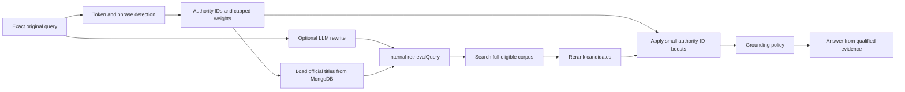

# Authority-Hint Retrieval

## Purpose

This document explains the minimal authority-mapping change used by the Egyptian legal research backend.

The mapping is a retrieval hint. It does not decide which law legally governs the user's facts, classify the question, or exclude the rest of the legal corpus.

The implementation recognizes three verified canonical authorities:

| Domain | Authority ID | Official authority |
| --- | --- | --- |
| Labor | `eg-law-14-2025-labor` | Labor Law issued by Law No. 14 of 2025 |
| Social insurance | `eg-law-148-2019-social-insurance-pensions` | Social Insurance and Pensions Law issued by Law No. 148 of 2019 |
| Public contracts | `eg-law-182-2018-public-contracts` | Law Regulating Contracts Concluded by Public Entities issued by Law No. 182 of 2018 |

The exact Arabic titles used to expand a search are loaded from MongoDB. They are not duplicated as hard-coded retrieval titles.

## Goals

- Detect all relevant supported legal domains in one question.
- Improve retrieval for generic questions without assuming one definitive governing law.
- Preserve the user's exact original question.
- Keep legacy judgments, principles, explanations, and eligible unknown-authority records searchable.
- Prefer precise phrases over ambiguous individual words.
- Respect explicit law references supplied by the user.
- Keep the change reversible and isolated from database and API contracts.

## Non-goals

The implementation does not:

- update or delete MongoDB records;
- change document classifications or authority statuses;
- verify an `authorityStatus: "unknown"` record;
- create a migration or collection;
- add an authority hard filter;
- alter API request or response schemas;
- replace legal reasoning with keyword classification;
- restructure the backend.

## Processing flow



Three query values are intentionally distinct:

- `originalQuery`: the exact user input, including its original wording.
- `rewrittenQuery`: the user query or optional LLM rewrite before authority-title expansion. Legal-reference parsing uses this value so an automatically appended title cannot become a hard legal-reference filter.
- `retrievalQuery`: the internal search text. It contains `rewrittenQuery` plus MongoDB official titles for detected domains.

Only `retrievalQuery` is sent to candidate retrieval. The answer generator still receives the exact original question.

## Multi-domain detection

The old implementation iterated over one large mapping object, used raw substring matching, and returned after its first match. It could therefore select only one law and could match a keyword inside an unrelated word or context.

The new implementation evaluates all three supported domains independently. Each domain can produce one authority hint:

```ts
{
  domain: "labor",
  authorityId: "eg-law-14-2025-labor",
  weight: 0.08,
  matchedAliases: ["حقوق العامل", "عامل", "الفصل"]
}
```

Matching uses normalized token sequences:

1. Arabic characters, digits, punctuation, and spaces are normalized using the existing Arabic normalizer.
2. The normalized text is split into tokens.
3. A one-word alias must equal a complete token.
4. A phrase must equal a contiguous sequence of complete tokens.
5. Context-dependent aliases activate only if their required context is also present.

No alias is selected through raw `query.includes(alias)` matching.

## Alias confidence and weights

Specific phrases receive stronger weights than individual words. All matching alias weights within a domain are added, then capped at `0.08`.

Examples:

| Signal | Behavior |
| --- | --- |
| `عقد عمل` | Strong labor signal |
| `عامل` | Weaker labor signal |
| `عمل` | Never a standalone labor alias |
| `فصل` | Requires labor context such as `عامل`, `عمال`, `موظف`, `صاحب العمل`, or `عقد عمل` |
| `موظف` | Weight is below the activation threshold when used alone because it can describe public employment |
| `التأمينات الاجتماعية` | Strong social-insurance signal |
| `تأمين` | Never a standalone social-insurance alias |
| `معاش` | Moderate social-insurance signal |
| `جهة إدارية` | Requires procurement context |
| `مناقصة` or `مزايدة` | Public-contract signal |
| `شراء` or `تعاقد` | Weak alone; can support stronger procurement context |

A domain must reach a minimum score of `0.02` before it becomes a hint. This prevents weak ambiguous signals such as `موظف` alone from activating a canonical law.

## Explicit law references

An explicit law number and year supplied by the user override automatic mapping only for the same domain.

Example:

```text
ما حكم فصل العامل في قانون العمل رقم 12 لسنة 2003؟
```

The labor vocabulary is detected, but no automatic boost to Labor Law 14/2025 is applied. The system preserves the user's explicit reference to Law 12/2003.

Cross-domain detection remains active:

```text
تأثير قانون العمل رقم 14 لسنة 2025 على التأمينات الاجتماعية
```

Result:

- no automatic labor boost, because labor law is already explicit;
- Social Insurance Law 148/2019 is still detected and boosted;
- the original query remains unchanged.

The known historical references used for same-domain protection are:

- Labor: 14/2025 and 12/2003.
- Social insurance: 148/2019 and 79/1975.
- Public contracts: 182/2018 and 89/1998.

An explicit number and year near a recognized domain title also suppresses automatic replacement for that domain. This protects explicit references even when they are not one of the predefined number/year pairs.

## MongoDB official-title resolution

After domain detection, `QueryRewriteService` loads titles for the detected authority IDs from the existing `legal_chunks` model.

The title lookup requires:

- the exact authority ID;
- Egyptian jurisdiction;
- `is_retrievable: true`;
- `reviewStatus: "published"`;
- `authorityStatus` equal to `effective` or `amended`;
- a non-empty `authorityTitleOfficial`.

The titles are cached in memory for five minutes. The cache avoids querying MongoDB for every request while still allowing database title corrections to appear without restarting the backend.

If title loading fails, retrieval continues safely:

- the original or LLM-rewritten query is still searched;
- detected authority-ID boosts remain available;
- no authority title is invented or hard-coded as a fallback;
- the full eligible corpus remains searchable.

## Retrieval-query expansion

For a generic labor question:

```text
Original: ما مدة إجازة العامل؟
```

The internal search can become:

```text
ما مدة إجازة العامل؟ قانون العمل الصادر بالقانون رقم 14 لسنة 2025
```

This expansion is internal. It does not modify the stored user message, the question passed to answer generation, or the API request/response shapes.

For a multi-domain question, unique official titles for every detected domain are appended. No first-match exit exists.

For an unrelated question:

```text
ما شروط صحة عقد البيع؟
```

No supported domain is detected, no title is appended, and no authority boost is produced.

## Bounded authority boosts

After normal reranking, a chunk receives a boost only when its exact `authorityId` matches a detected hint.

Rules:

- each boost is clamped between `0` and `0.08`;
- the final rerank score cannot exceed `1`;
- nonmatching chunks keep their existing score;
- all chunks are sorted again after boosts;
- evidence ranks are recalculated.

Example:

| Candidate | Initial score | Boost | Final score |
| --- | ---: | ---: | ---: |
| Highly relevant legacy judgment | 0.99 | 0 | 0.99 |
| Related canonical labor chunk | 0.90 | 0.08 | 0.98 |

The legacy judgment remains first. The mapping improves canonical-law discoverability but does not force canonical chunks above more relevant evidence.

## Legacy and unknown records

This implementation does not change retrieval eligibility or grounding policy.

Therefore:

- `legacy-*` records remain candidates when they satisfy the existing retrieval rules;
- published records with `authorityStatus: "unknown"` remain candidates when currently allowed by grounding;
- an unknown record can appear in the final evidence and support the answer if it passes existing relevance and grounding checks;
- unknown records do not receive a verified canonical boost unless their exact authority ID is one of the three configured verified IDs;
- the mapping never changes `unknown` to `effective`, `amended`, or verified;
- no record is excluded merely because it is legacy or unknown.

## Configuration and rollback

The feature is controlled by:

```env
LEGALMIND_ENABLE_AUTHORITY_HINTS=true
```

The default is enabled. Setting it to `false` disables automatic domain detection, title expansion, and authority boosts while leaving ordinary query rewriting and retrieval intact.

The previous `LEGALMIND_ENABLE_LEGACY_LAW_MAPPING` setting is no longer used because there is no second legacy mapping flow.

## Tests

Focused unit tests cover:

- detecting labor and social insurance in one query;
- stronger phrase weights than individual-word weights;
- rejecting ambiguous standalone aliases;
- procurement context requirements for `جهة إدارية`;
- explicit same-domain law override;
- explicit labor reference plus social-insurance detection;
- maximum boost enforcement;
- allowing a stronger legacy result to remain above a boosted canonical result;
- exact preservation of `originalQuery`;
- separation of `rewrittenQuery` and `retrievalQuery`;
- MongoDB-title expansion through an injected test loader;
- unchanged behavior for unrelated questions.

Validation completed after implementation:

```text
npm run typecheck   -> passed
npm run test:query  -> 15 tests passed, 0 failed
```

## Files changed

- `backend-ts/src/utils/law-mapping.ts`: domain definitions, normalized matching, explicit-reference protection, query expansion, and bounded boosts.
- `backend-ts/src/services/query-rewrite.service.ts`: original/rewritten/retrieval query separation, MongoDB title loading, and caching.
- `backend-ts/src/services/query.service.ts`: searches with `retrievalQuery` and applies authority boosts without hard filters.
- `backend-ts/src/types/query.types.ts`: internal rewrite metadata for retrieval queries, multiple matches, and boosts.
- `backend-ts/src/config/env.ts`: new authority-hints feature flag.
- `backend-ts/.env.example`: documents the new feature flag.
- `backend-ts/src/query-tests/authority-mapping.unit.test.ts`: focused behavior tests.

## Safety summary

The final behavior is deliberately conservative:

> Detect likely domains, expand retrieval using verified MongoDB titles, add small exact-ID boosts, and let normal relevance plus grounding decide the evidence.

It does not claim that a detected canonical law is definitely the only applicable authority.
