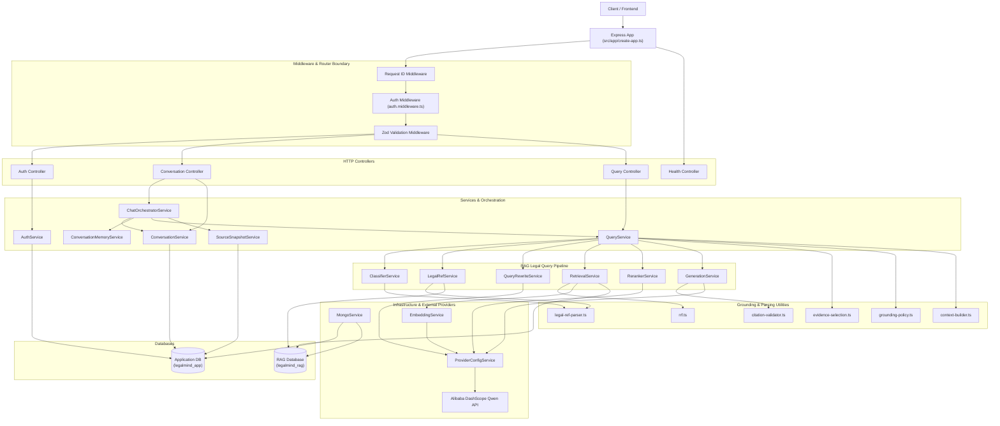

# LegalMind Backend System Architecture Guide

> **Status**: Implemented (Graduation Scope) with Planned SaaS Architecture
> **Source verified**: `src/index.ts`, `src/app/create-app.ts`, `src/services/service-container.ts`
> **Last verified against code**: 2026-07-31

---

## Table of Contents

- [1. Overview & Purpose](#1-overview--purpose)
- [2. Technology Stack](#2-technology-stack)
- [3. Application Boundaries](#3-application-boundaries)
- [4. High-Level Component Diagram](#4-high-level-component-diagram)
- [5. Core Architectural Modules](#5-core-architectural-modules)
  - [5.1 Authentication & User Management](#51-authentication--user-management)
  - [5.2 Legal Chat Pipeline (RAG)](#52-legal-chat-pipeline-rag)
  - [5.3 Conversation Persistence & History](#53-conversation-persistence--history)
  - [5.4 Contract Analysis (Planned Scope)](#54-contract-analysis-planned-scope)
  - [5.5 Legal Corpus & Governance](#55-legal-corpus--governance)
  - [5.6 External Provider Integrations](#56-external-provider-integrations)
  - [5.7 Dual-Database Architecture](#57-dual-database-architecture)
  - [5.8 Migration & Operator Scripts](#58-migration--operator-scripts)
- [6. Security Boundaries](#6-security-boundaries)
- [7. Graduation Scope vs. Future SaaS Scope](#7-graduation-scope-vs-future-saas-scope)
- [8. Related Documentation](#8-related-documentation)

---

## 1. Overview & Purpose

**LegalMind** is an AI-powered legal intelligence platform specifically engineered for the Egyptian legal system. Its backend provides high-precision Retrieval-Augmented Generation (RAG) over official Egyptian statutes, codes, decrees, and Court of Cassation rulings.

The system ensures strict legal grounding, eliminating hallucination risks by validating every legal answer against published Egyptian legal chunks, formatting verbatim source citations, and persisting immutable source snapshots for historical auditability.

---

## 2. Technology Stack

- **Runtime & Language**: Node.js v24+, TypeScript 5.9+, Express 5.1+
- **Databases**: Dual MongoDB topology (Community/Atlas Mongoose 9.7+)
  - `legalmind_app`: Application metadata, user accounts, sessions, conversations, messages.
  - `legalmind_rag`: Indexed Egyptian legal corpus, vector embeddings, and search metadata.
- **Search Engine**: MongoDB Atlas Search (`$vectorSearch` for 1024-dim dense embeddings + `$search` for lexical token matching with Lucene Arabic analyzer).
- **AI/LLM Provider**: Alibaba Cloud DashScope (ModelStudio Compatible API)
  - LLM: `qwen-plus` (Primary generation), `qwen-turbo` (Query rewrite & Fallback)
  - Embedding: `text-embedding-v4` (1024 dimensions)
  - Reranker: `qwen3-rerank` (Semantic re-scoring)
- **Validation & Schemas**: Zod 4.1+ for request payload validation & environment schema parsing.
- **Authentication**: JWT (JSON Web Tokens) with HTTP-only `SameSite=Lax` refresh cookies, Bcrypt password hashing (12 rounds).
- **Storage & Uploads**: Multer 2.2+ for private lawyer ID credential verification uploads.
- **Email Service**: Nodemailer 9.0+ supporting SMTP transport and local development console logging.

---

## 3. Application Boundaries

The LegalMind backend exposes a RESTful HTTP API. The system boundaries are strictly demarcated as follows:

```text
 [ User Browser / Client ]
            │ (HTTPS / Bearer Token & HTTP-Only Cookie)
            ▼
 ┌────────────────────────────────────────────────────────────────────────┐
 │ LegalMind Express 5.1 Application Boundary                             │
 │                                                                        │
 │  ┌─────────────────┐    ┌────────────────────┐    ┌─────────────────┐ │
 │  │ Auth Middleware │ ──►│ Express Controllers│ ──►│ Service         │ │
 │  │ & Zod Validation│    │ (Auth, Chat, Query)│    │ Container       │ │
 │  └─────────────────┘    └────────────────────┘    └────────┬────────┘ │
 └────────────────────────────────────────────────────────────┼───────────┘
                                                              │
                    ┌─────────────────────────────────────────┴────────────────────────────────────────┐
                    ▼                                                                                  ▼
 ┌──────────────────────────────────────┐                                           ┌────────────────────────────────────┐
 │ Application Database (legalmind_app) │                                           │ RAG Database (legalmind_rag)       │
 │ - users                              │                                           │ - legal_chunks                     │
 │ - refresh_tokens                     │                                           │ - (Atlas Vector & Text Indexes)    │
 │ - conversations                      │                                           │                                    │
 │ - messages                           │                                           │                                    │
 └──────────────────────────────────────┘                                           └────────────────────────────────────┘
```

---

## 4. High-Level Component Diagram

The diagram below reflects the runtime execution dependencies wired in `src/services/service-container.ts`.



---

## 5. Core Architectural Modules

### 5.1 Authentication & User Management
* **Implementation Status**: `Implemented`
* **Primary Source Files**: `src/modules/auth/*`, `src/modules/users/*`, `src/modules/refresh-tokens/*`
* **Responsibilities**: User registration, login, email verification, password reset, role authorization (`citizen`, `lawyer`, `admin`), JWT short-lived access tokens (15m), HTTP-only `SameSite=Lax` refresh cookie rotation (7d), and private lawyer ID uploads (`Multer`).

### 5.2 Legal Chat Pipeline (RAG)
* **Implementation Status**: `Implemented`
* **Primary Source Files**: `src/services/query.service.ts`, `src/services/retrieval.service.ts`, `src/services/reranker.service.ts`, `src/services/generation.service.ts`
* **Responsibilities**: Classifies intent (`social_chat`, `exact_reference`, `legal_question`). Handles hybrid retrieval (vector similarity + keyword search) with RRF fusion, LLM reranking, strict grounding policy thresholds (`MIN_QUALIFIED_SCORE = 0.40`), parent/child chunk expansion, and Arabic context building.

### 5.3 Conversation Persistence & History
* **Implementation Status**: `Implemented`
* **Primary Source Files**: `src/services/chat-orchestrator.service.ts`, `src/services/conversation-memory.service.ts`, `src/modules/conversations/*`
* **Responsibilities**: User turn idempotency resolution (`idempotencyKey`), atomic sequence number allocation per message, windowed history loading, standalone query generation for multi-turn conversations, progressive conversation summary updates, and soft deletion (`status = 'deleted'`).

### 5.4 Contract Analysis (Planned Scope)
* **Implementation Status**: `Planned`
* **Note**: Contract analysis upload and risk auditing is planned for future SaaS iterations. No active routes or database models currently exist for contract processing.

### 5.5 Legal Corpus & Governance
* **Implementation Status**: `Implemented with known limitations`
* **Primary Source Files**: `src/legal-governance/authority-status-registry.ts`, `src/models/chunk.model.ts`
* **Responsibilities**: Metadata filter enforcement for Egyptian law retrieval (`jurisdiction = 'EG'`, `isRetrievable = true`, `reviewStatus = 'published'`, `authorityStatus IN ['effective', 'amended']`).

### 5.6 External Provider Integrations
* **Implementation Status**: `Implemented`
* **Primary Source Files**: `src/services/provider-config.service.ts`, `src/services/provider-http.service.ts`
* **Responsibilities**: Round-robin API key rotation across multiple DashScope accounts (`LEGALMIND_DASHSCOPE_API_KEYS`), automatic retry handling on transient 429/500 errors, exponential backoff with jitter, and model timeout configuration.

### 5.7 Dual-Database Architecture
* **Implementation Status**: `Implemented`
* **Primary Source Files**: `src/services/mongo.service.ts`
* **Responsibilities**: Manages independent Mongoose connection instances for `legalmind_app` (user accounts, tokens, conversations, messages) and `legalmind_rag` (indexed legal chunks and vector search indexes).

### 5.8 Migration & Operator Scripts
* **Implementation Status**: `Implemented`
* **Primary Source Files**: `src/scripts/*`
* **Responsibilities**: Database setup scripts for standard Mongoose indexes (`setup-app-indexes.ts`), Mongo Atlas Search indexes (`setup-atlas-search-indexes.ts`), corpus classification/auditing, and automated benchmark evaluation (`evaluate.ts`).

---

## 6. Security Boundaries

1. **Authentication & Ownership Scoping**: Every private endpoint verifies the Bearer access token via `authMiddleware`. All conversation queries filter by `ownerUserId = req.user.id` and `organizationId = req.user.organizationId` (when available). Unauthorized access returns a `404 Not Found` to prevent resource enumeration.
2. **Untrusted Data Boundaries**: Retrieved legal chunk text is treated as un-trusted text and wrapped in clear delimiters (`[SOURCE X]`) inside LLM prompts to prevent prompt injection.
3. **Secret Management**: API keys and JWT secrets are managed strictly via environment variables parsed and validated by Zod at startup. Raw error tracebacks are stripped in production responses.

---

## 7. Graduation Scope vs. Future SaaS Scope

| Feature / Control | Current Graduation Scope | Future SaaS Scope |
|---|---|---|
| **Multi-Tenancy** | Single user ownership (`ownerUserId`), optional `organizationId` | Full organization multi-tenancy, team roles, matter-level permissions |
| **Corpus Governance** | Embedded chunk metadata (`authorityStatus`, `reviewStatus`) | Dedicated `legal_authorities` & `corpus_releases` database collections |
| **Contract Analysis** | Planned proposal | Automated contract analysis, clause extraction, risk scoring |
| **Storage & Uploads** | Local disk storage for lawyer IDs | AWS S3 / Azure Blob encrypted private storage with pre-signed URLs |
| **Billing & Quotas** | Fixed rate-limiting per IP | Dynamic usage budgets, token tracking, subscription billing |

---

## 8. Related Documentation

- [Request Lifecycle](REQUEST_LIFECYCLE.md) - Detailed step-by-step trace of HTTP requests.
- [Auth Architecture](AUTH_ARCHITECTURE.md) - Authentication & JWT token security guide.
- [Conversation Architecture](CONVERSATION_ARCHITECTURE.md) - Chat memory, sequence allocation, and snapshots.
- [Legal Query Pipeline](LEGAL_QUERY_PIPELINE.md) - Deep dive into RAG classification, retrieval, and generation.
- [Database Architecture](DATABASE_ARCHITECTURE.md) - Dual database topology and schema definitions.
- [API Reference](API_REFERENCE.md) - Complete OpenAPI-style API specification.
