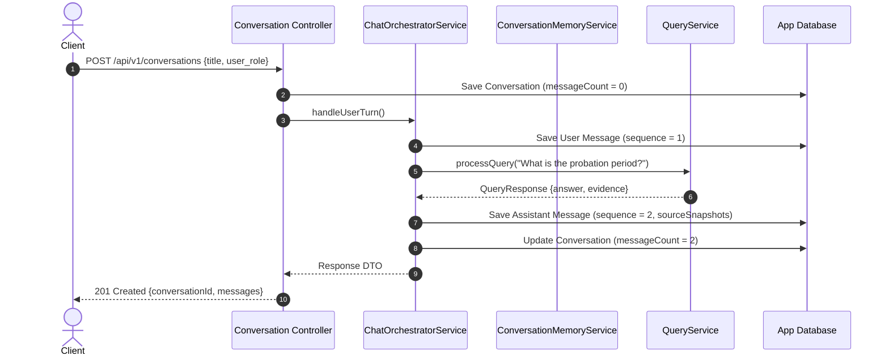
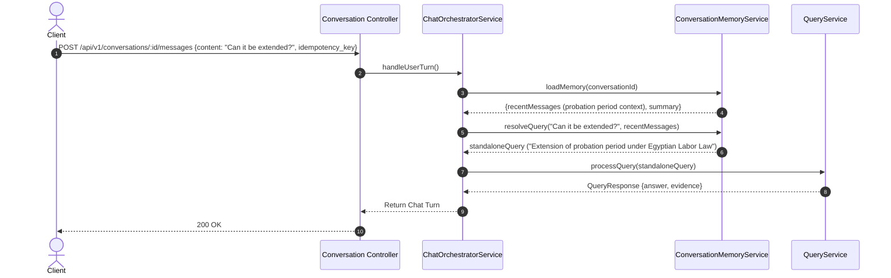

# LegalMind Conversation & Memory Architecture

> **Status**: Implemented
> **Source verified**: `src/modules/conversations/*`, `src/services/chat-orchestrator.service.ts`, `src/services/conversation-memory.service.ts`, `src/services/source-snapshot.service.ts`
> **Last verified against code**: 2026-07-31

---

## Table of Contents

- [1. Overview](#1-overview)
- [2. Architectural Responsibilities](#2-architectural-responsibilities)
- [3. User Ownership & Multi-Tenant Boundaries](#3-user-ownership--multi-tenant-boundaries)
- [4. Message Sequencing & Concurrent Ordering](#4-message-sequencing--concurrent-ordering)
- [5. Idempotency & Duplicate Request Protection](#5-idempotency--duplicate-request-protection)
- [6. Message Persistence Lifecycle](#6-message-persistence-lifecycle)
- [7. Multi-Turn Memory & Standalone Query Generation](#7-multi-turn-memory--standalone-query-generation)
- [8. Progressive Summary Lifecycle](#8-progressive-summary-lifecycle)
- [9. Soft Deletion & Archiving Policy](#9-soft-deletion--archiving-policy)
- [10. Source Snapshot Immutability](#10-source-snapshot-immutability)
- [11. Sequence Diagrams](#11-sequence-diagrams)
- [12. Related Documentation](#12-related-documentation)

---

## 1. Overview

The conversation architecture manages stateful, multi-turn legal chat sessions in LegalMind. It handles message ordering, idempotency, history windowing, standalone RAG query resolution, summary progression, and immutable citation snapshot storage.

---

## 2. Architectural Responsibilities

The conversation system separates state across distinct domain entities:

| Component | Responsibility | Database Target |
|---|---|---|
| **Conversation Metadata** | Thread state, title, owner, message counters, summary, status (`active`/`archived`/`deleted`). | `legalmind_app.conversations` |
| **User Messages** | Raw user queries stored prior to LLM/RAG pipeline execution. | `legalmind_app.messages` (`role: 'user'`) |
| **Assistant Messages** | Grounded legal answers, status (`completed`/`failed`), citations, and diagnostics. | `legalmind_app.messages` (`role: 'assistant'`) |
| **Conversation Summary** | Running context summary updated progressively after long multi-turn sessions. | `conversations.summary` |
| **Active Legal Context** | In-memory evidence context assembled during a single turn for LLM prompt generation. | Transient memory in `QueryService` |
| **Source Snapshots** | Frozen, immutable copies of source metadata and excerpts attached to an assistant turn. | `messages.sourceSnapshots` |
| **Retrieval Diagnostics** | Execution metrics (retrieval mode, RRF scores, grounding confidence, latency). | `messages.diagnostics` |

---

## 3. User Ownership & Multi-Tenant Boundaries

1. **Strict User Extraction**: User identity is derived **exclusively** from the validated JWT token (`req.user.id`). User IDs provided in request bodies are ignored.
2. **Mandatory Ownership Filtering**: Every conversation query enforces user scoping:
   ```ts
   const conversation = await ConversationModel.findOne({
     conversationId,
     ownerUserId: user.id,
     status: { $ne: "deleted" }
   });
   ```
3. **Security Refusal (404 Not Found)**: If User A attempts to access User B's conversation, the backend returns `404 Not Found` rather than `403 Forbidden` to prevent resource ID enumeration attacks.

---

## 4. Message Sequencing & Concurrent Ordering

Timestamps alone are insufficient for message ordering due to clock drift and sub-millisecond API execution speeds.

* **Sequence Field**: Every message includes an integer `sequence` starting at `1` for the first user message.
* **Atomic Allocation**: When saving a new turn, `ChatOrchestratorService` increments the sequence atomically:
  - User message: `sequence = currentCount + 1`
  - Assistant response: `sequence = currentCount + 2`
* **Unique Compound Index**:
  ```text
  Collection: messages
  Index: { conversationId: 1, sequence: 1 } (Unique)
  ```
  This index guarantees strict chronological ordering and prevents race conditions under concurrent submissions.

---

## 5. Idempotency & Duplicate Request Protection

Clients generate a unique UUID v4 `idempotencyKey` per submission.

* **Database Constraint**: `messages` collection enforces a unique sparse index:
  ```text
  Index: { ownerUserId: 1, idempotencyKey: 1 } (Unique, Sparse)
  ```
* **Replay Handling**: If a network retry occurs and `ChatOrchestratorService` detects an existing message with the same `idempotencyKey`, it bypasses the RAG pipeline and immediately returns the previously saved assistant message.

---

## 6. Message Persistence Lifecycle

```text
 ┌───────────────────────────┐
 │ 1. User Message Received  │ ──► Saved to DB (role: 'user', sequence: N+1)
 └─────────────┬─────────────┘
               │
               ▼
 ┌───────────────────────────┐
 │ 2. Execute RAG Pipeline   │
 └─────────────┬─────────────┘
               │
       ┌───────┴─────────────────────────────────┐
       ▼                                         ▼
 [ Success Path ]                         [ Failure Path ]
 Saved to DB:                             Saved to DB:
 - role: 'assistant'                      - role: 'assistant'
 - status: 'completed'                    - status: 'failed'
 - sequence: N+2                          - sequence: N+2
 - content: Generated Answer              - content: Error Message
 - sourceSnapshots: Frozen Sources        - errorMetadata: { code, details }
```

---

## 7. Multi-Turn Memory & Standalone Query Generation

In a multi-turn conversation, user follow-up questions often contain pronouns or implicit references (e.g., *"What is its penalty?"* after discussing *"Article 12"*).

1. **Windowed History**: `ConversationMemoryService` loads the last 10 messages from history.
2. **LLM Query Disambiguation**: `ConversationMemoryService.resolveQuery()` formats history + summary into a prompt:
   - Input: Previous turn + current user input *"What is its penalty?"*
   - Output: `standaloneQuery` = *"Penalty for violating Article 12 of Egyptian Labor Law No. 12 of 2003"*
3. **Isolated Search**: The RAG pipeline (`QueryService`) executes retrieval using `standaloneQuery`, ensuring vector and text searches find relevant legal chunks without conversational noise.

---

## 8. Progressive Summary Lifecycle

* **Threshold**: When message count exceeds 6 turns, `ConversationMemoryService.updateSummaryIfNeeded()` triggers an asynchronous summary update.
* **Content Constraints**: Summaries record established user legal facts and questions. Summaries **must never** promote unverified legal claims or assistant answers into binding legal authority.

---

## 9. Soft Deletion & Archiving Policy

LegalMind uses **soft deletion** for conversations to satisfy auditability and data recovery requirements:
* **Active**: `status = 'active'` (Normal display)
* **Archived**: `status = 'archived'` (Read-only, hidden from active sidebar)
* **Soft Deleted**: `status = 'deleted'` (Excluded from all standard queries via `{ status: { $ne: 'deleted' } }`)

---

## 10. Source Snapshot Immutability

When an assistant response cites legal evidence, `SourceSnapshotService` converts retrieved `LegalChunk` documents into frozen `SourceSnapshot` objects stored directly inside the assistant message payload:

```ts
type SourceSnapshot = {
  chunkId: string;
  authorityId: string;
  authorityTitle: string;
  lawNumber?: string;
  lawYear?: number;
  articleNumber?: string;
  excerpt: string;
  similarityScore: number;
};
```

**Why Immutability Matters**: If the legal corpus is re-indexed or amended in the future, historical chat logs continue to display the exact legal source text that was present when the answer was originally generated.

---

## 11. Sequence Diagrams

### 11.1 New Conversation & Initial Turn


### 11.2 Follow-Up Message & Memory Resolution


---

## 12. Related Documentation

- [Request Lifecycle](REQUEST_LIFECYCLE.md) - Full HTTP execution trace.
- [Legal Query Pipeline](LEGAL_QUERY_PIPELINE.md) - Pipeline execution.
- [Conversation Service](services/CONVERSATION_SERVICE_IMPLEMENTATION.md) - Service implementation details.
- [Message Model](database/MESSAGE_MODEL.md) - Message schema & index specifications.
