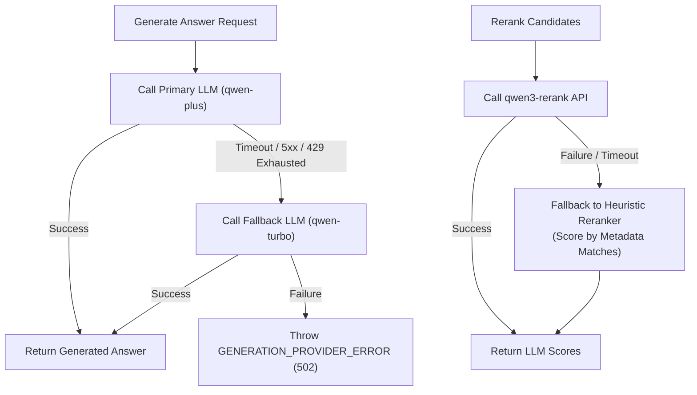

# LegalMind Reliability, Error Handling & Retry Architecture

> **Status**: Implemented with Known Limitations
> **Source verified**: `src/middlewares/error-handler.ts`, `src/services/provider-http.service.ts`, `src/services/reranker.service.ts`, `src/errors/*`
> **Last verified against code**: 2026-07-31

---

## Table of Contents

- [1. Overview](#1-overview)
- [2. Global Error Handling Architecture](#2-global-error-handling-architecture)
  - [2.1 Custom Error Hierarchy](#21-custom-error-hierarchy)
  - [2.2 Uniform API Error Response Envelope](#22-uniform-api-error-response-envelope)
  - [2.3 Request ID Tracing](#23-request-id-tracing)
  - [2.4 Provider Error Sanitization](#24-provider-error-sanitization)
- [3. HTTP Timeout Policy & Known Limitation](#3-http-timeout-policy--known-limitation)
- [4. HTTP Retry Policy & Backoff Strategy](#4-http-retry-policy--backoff-strategy)
- [5. Provider Fallback Mechanisms](#5-provider-fallback-mechanisms)
- [6. Database Resilience & Readiness Probes](#6-database-resilience--readiness-probes)
- [7. Chat Turn Failure States](#7-chat-turn-failure-states)
- [8. Related Documentation](#8-related-documentation)

---

## 1. Overview

This document details the reliability patterns, error propagation mechanisms, retry strategies, and fault-tolerance policies engineered into the LegalMind backend to maintain uptime across database hiccups and external LLM provider failures.

---

## 2. Global Error Handling Architecture

### 2.1 Custom Error Hierarchy
LegalMind extends standard JavaScript `Error` objects with structured HTTP exceptions (`src/errors/`):

```text
       ┌────────────────────────┐
       │      native Error      │
       └───────────┬────────────┘
                   │
       ┌───────────┴────────────┐
       │       HttpError        │ (statusCode, errorCode, message)
       └───────────┬────────────┘
                   │
 ┌─────────────────┼─────────────────┬──────────────────┐
 ▼                 ▼                 ▼                  ▼
UnauthorizedError  NotFoundError  ForbiddenError  RequestValidationError
  (401)              (404)          (403)              (400)
```

### 2.2 Uniform API Error Response Envelope
All uncaught exceptions and rejected promises are caught by `errorHandler` (`src/middlewares/error-handler.ts`), serializing a standard JSON error response:

```json
{
  "success": false,
  "error": {
    "code": "REQUEST_VALIDATION_ERROR",
    "message": "Invalid request payload",
    "details": [
      {
        "field": "email",
        "message": "Invalid email address format"
      }
    ],
    "requestId": "req_8f9a2b1c-3d4e-5f6a"
  }
}
```

### 2.3 Request ID Tracing
Every incoming HTTP request is assigned a unique UUID v4 header (`X-Request-ID`) via `requestIdMiddleware`. This identifier is attached to every logger statement and error payload, enabling developers to trace failures across service logs.

### 2.4 Provider Error Sanitization
Raw API keys, internal endpoint URLs, or DashScope stack traces are sanitized before sending responses to clients. Low-level provider errors are logged server-side and transformed into generic `502 Bad Gateway` or `504 Gateway Timeout` errors.

---

## 3. HTTP Timeout Policy & Known Limitation

External provider requests issued by `ProviderHttpService` enforce strict timeouts:
* **LLM Generation Timeout**: 15,000ms (15 seconds)
* **Embedding Timeout**: 8,000ms (8 seconds)
* **Reranker Timeout**: 8,000ms (8 seconds)

> [!WARNING]
> **Known Implementation Limitation**:
> `ProviderHttpService` uses Node.js `AbortController` timers that monitor the HTTP connection and response header arrival. In the current implementation, if an HTTP response stream begins receiving headers, the timeout timer is disarmed before the complete response body is read. A stalled response body stream could theoretically hang until the global Express connection socket times out.

---

## 4. HTTP Retry Policy & Backoff Strategy

`ProviderHttpService` wraps all outbound HTTP calls to DashScope with an exponential backoff retry loop.

### 4.1 Retried Status Codes
The service automatically retries operations on transient network errors or rate limits:
- `429 Too Many Requests`
- `500 Internal Server Error`
- `502 Bad Gateway`
- `503 Service Unavailable`
- `504 Gateway Timeout`

### 4.2 Non-Retried Status Codes
Client-side error status codes are failed immediately without retrying:
- `400 Bad Request` (Invalid JSON payload)
- `401 Unauthorized` (Invalid API key)
- `403 Forbidden` (Quota exhausted or IP blocked)
- `404 Not Found` (Invalid model endpoint)

### 4.3 Backoff & Jitter Calculation
- **Initial Delay**: 500ms
- **Multiplier**: 2.0x
- **Max Delay**: 4,000ms
- **Jitter**: ±20% randomized noise to prevent thundering herd spikes on provider endpoints.
- **`Retry-After` Support**: Respects HTTP `Retry-After` response headers when present.

---

## 5. Provider Fallback Mechanisms

LegalMind includes automated fallback rules when primary LLM services fail:



---

## 6. Database Resilience & Readiness Probes

- **Startup Resilience**: `MongoService` initiates parallel connections to `legalmind_app` and `legalmind_rag` with a 10-second connection timeout (`LEGALMIND_MONGO_CONNECT_TIMEOUT_MS=10000`). If connection fails, server startup aborts cleanly with a fatal log.
- **Readiness Endpoint (`GET /ready`)**: Ping queries both databases (`appConn.db.admin().ping()` and `ragConn.db.admin().ping()`). If either database fails to respond within 2,000ms, `/ready` returns `503 Service Unavailable`, signalling load balancers to remove the instance.

---

## 7. Chat Turn Failure States

When an assistant turn fails due to provider timeouts or LLM error:
1. **User Message Preserved**: The user's input message remains permanently stored in `messages` at sequence `N`.
2. **Assistant Failure Record**: An assistant message record is created at sequence `N+1` with:
   - `status = 'failed'`
   - `content = "تعذر الحصول على إجابة من المزود حالياً"`
   - `errorMetadata = { code: 'GENERATION_TIMEOUT', status: 504 }`
3. **Recovery**: The user can retry the turn without corrupting the message sequence numbering.

---

## 8. Related Documentation

- [Backend Architecture](BACKEND_ARCHITECTURE.md) - System overview.
- [Request Lifecycle](REQUEST_LIFECYCLE.md) - Failure flow traces.
- [HTTP Retry & Timeout Utility](utilities/HTTP_RETRY_AND_TIMEOUT.md) - `ProviderHttpService` implementation details.
