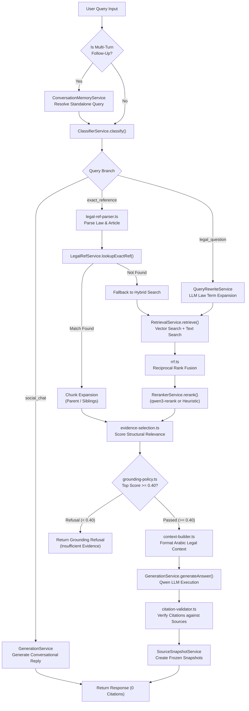

# LegalMind Legal Query Pipeline Architecture

> **Status**: Implemented
> **Source verified**: `src/services/query.service.ts`, `src/services/classifier.service.ts`, `src/services/retrieval.service.ts`, `src/services/reranker.service.ts`, `src/services/generation.service.ts`
> **Last verified against code**: 2026-07-31

---

## Table of Contents

- [1. Overview](#1-overview)
- [2. Pipeline Flowchart](#2-pipeline-flowchart)
- [3. Execution Paths](#3-execution-paths)
  - [3.1 Social Chat Path](#31-social-chat-path)
  - [3.2 Exact Legal-Reference Path](#32-exact-legal-reference-path)
  - [3.3 General Hybrid RAG Path](#33-general-hybrid-rag-path)
  - [3.4 Follow-Up Disambiguation Path](#34-follow-up-disambiguation-path)
- [4. Detailed Stage-by-Stage Breakdown](#4-detailed-stage-by-stage-breakdown)
  - [Stage 1: Intent Classification](#stage-1-intent-classification)
  - [Stage 2: Reference Parsing & Exact Lookup](#stage-2-reference-parsing--exact-lookup)
  - [Stage 3: LLM Query Rewriting](#stage-3-llm-query-rewriting)
  - [Stage 4: Hybrid Retrieval (Vector + Text Search)](#stage-4-hybrid-retrieval-vector--text-search)
  - [Stage 5: Reciprocal Rank Fusion (RRF)](#stage-5-reciprocal-rank-fusion-rrf)
  - [Stage 6: Reranking & Score Normalization](#stage-6-reranking--score-normalization)
  - [Stage 7: Evidence Selection & Structural Matching](#stage-7-evidence-selection--structural-matching)
  - [Stage 8: Grounding Policy Evaluation](#stage-8-grounding-policy-evaluation)
  - [Stage 9: Neighboring Chunk Expansion](#stage-9-neighboring-chunk-expansion)
  - [Stage 10: Arabic Context Construction](#stage-10-arabic-context-construction)
  - [Stage 11: Grounded LLM Generation](#stage-11-grounded-llm-generation)
  - [Stage 12: Citation Validation](#stage-12-citation-validation)
  - [Stage 13: Source Snapshot Persistence](#stage-13-source-snapshot-persistence)
- [5. Related Documentation](#5-related-documentation)

---

## 1. Overview

The **Legal Query Pipeline** orchestrates the transformation of a user's natural language input into a verified, legally grounded Arabic answer backed by official Egyptian law citations. Controlled by `QueryService`, it employs a multi-stage routing strategy to minimize latency for exact article queries while maintaining dense semantic search coverage for broad legal questions.

---

## 2. Pipeline Flowchart



---

## 3. Execution Paths

### 3.1 Social Chat Path
* **Trigger**: Greetings (*"مرحباً"*, *"السلام عليكم"*), identity questions (*"من أنت؟"*), or conversational queries.
* **Latency**: ~300ms (Bypasses vector search and retrieval databases completely).
* **Return**: Direct response generated by LLM; returns 0 legal citations.

### 3.2 Exact Legal-Reference Path
* **Trigger**: Regex pattern match for specific articles or laws (e.g., *"المادة 12 من قانون العمل 12 لسنة 2003"* or *"الطعن رقم 450 لسنة 85 قضائية"*).
* **Execution**: Bypasses vector embeddings; executes indexed exact lookup on `legal_chunks` (`authorityId`, `articleNumber`, `lawNumber`, `lawYear`).
* **Fallback**: If the exact article is missing from the corpus, automatically falls back to General Hybrid RAG.

### 3.3 General Hybrid RAG Path
* **Trigger**: Substantive legal questions requiring semantic domain search (*"ما هي شروط إنهاء عقد العمل غير محدد المدة؟"*).
* **Execution**: Runs parallel MongoDB Atlas Vector Search (1024-dim dense vector) and Atlas Text Search (Arabic token search), merged via Reciprocal Rank Fusion (RRF), re-scored via LLM Reranker, and validated against Grounding Policy.

### 3.4 Follow-Up Disambiguation Path
* **Trigger**: Message submitted inside an active multi-turn conversation (`messageCount > 0`).
* **Execution**: `ConversationMemoryService` injects history into LLM prompt to generate a standalone query before entering the pipeline.

---

## 4. Detailed Stage-by-Stage Breakdown

### Stage 1: Intent Classification
* **Component**: `ClassifierService` (`src/services/classifier.service.ts`)
* **Logic**: Runs deterministic regex patterns against normalized Arabic query text to identify `exact_reference`, `social_chat`, or `legal_question`.
* **Output**: `ClassificationResult` containing branch type and parsed regex flags.

### Stage 2: Reference Parsing & Exact Lookup
* **Component**: `legal-ref-parser.ts` & `LegalRefService` (`src/services/legal-ref.service.ts`)
* **Logic**: Extracts law number, law year, article number, court appeal number, judicial year. Executes deterministic query on `legalmind_rag.legal_chunks`.
* **Output**: Target chunk (if found) or `null` trigger for fallback.

### Stage 3: LLM Query Rewriting
* **Component**: `QueryRewriteService` (`src/services/query-rewrite.service.ts`)
* **Logic**: Uses `qwen-turbo` model to expand abbreviations, add official Egyptian legal terminology, and standardize law titles. Controlled by `LEGALMIND_ENABLE_QUERY_REWRITE=true`.

### Stage 4: Hybrid Retrieval (Vector + Text Search)
* **Component**: `RetrievalService` (`src/services/retrieval.service.ts`)
* **Vector Path**: Generates 1024-dim embedding via `EmbeddingService` (`text-embedding-v4`) and executes `$vectorSearch` pipeline on `legal_chunks_vector`.
* **Text Path**: Executes `$search` pipeline on `legal_chunks_text` matching keywords with Arabic stemming analyzers.
* **Governance Filters Applied**:
  ```json
  {
    "jurisdiction": "EG",
    "isRetrievable": true,
    "reviewStatus": "published",
    "authorityStatus": { "$in": ["effective", "amended"] }
  }
  ```

### Stage 5: Reciprocal Rank Fusion (RRF)
* **Component**: `rrf.ts` (`src/utils/rrf.ts`)
* **Logic**: Merges vector search and text search candidate lists using formula:
  \( RRF\_Score(d) = \sum \frac{1}{k + rank(d)} \) where \( k = 60 \) (`LEGALMIND_RRF_K=60`).

### Stage 6: Reranking & Score Normalization
* **Component**: `RerankerService` (`src/services/reranker.service.ts`)
* **Logic**: Passes query + top 20 candidate chunks to `qwen3-rerank` model to compute relevance scores in range `[0.0, 1.0]`.
* **Fallback**: If `LEGALMIND_ENABLE_LLM_RERANK=false` or provider fails, executes `heuristicRerank()` using structural metadata matches.

### Stage 7: Evidence Selection & Structural Matching
* **Component**: `evidence-selection.ts` (`src/utils/evidence-selection.ts`)
* **Logic**: Re-balances candidates to prioritize higher authority types (e.g., Constitution > Statute > Executive Regulation > Secondary Summary).

### Stage 8: Grounding Policy Evaluation
* **Component**: `grounding-policy.ts` (`src/utils/grounding-policy.ts`)
* **Rule**: Evaluates candidate scores against threshold `MIN_QUALIFIED_SCORE = 0.40`.
* **Outcome**: If 0 candidates satisfy the threshold, returns refusal payload (*"لا تتوفر أدلة قانونية كافية لتأكيد الإجابة"*).

### Stage 9: Neighboring Chunk Expansion
* **Component**: `RetrievalService.expandContext()`
* **Logic**: If an article chunk references a parent or child chunk (`parentChunkId`), retrieves immediately adjacent chunks to provide full legal context.

### Stage 10: Arabic Context Construction
* **Component**: `context-builder.ts` (`src/utils/context-builder.ts`)
* **Format**: Constructs prompt context string:
  ```text
  [المصدر 1]: قانون العمل رقم 12 لسنة 2003 - المادة 12
  النص: يلتزم صاحب العمل...
  ```

### Stage 11: Grounded LLM Generation
* **Component**: `GenerationService` (`src/services/generation.service.ts`)
* **Prompt Rule**: Qwen model system prompt forces model to cite source numbers `[المصدر X]` and strictly refuse statements not supported by context.

### Stage 12: Citation Validation
* **Component**: `citation-validator.ts` (`src/utils/citation-validator.ts`)
* **Logic**: Scans generated text for bracketed citations `[المصدر X]` and strips any invalid citations that do not exist in the provided source list.

### Stage 13: Source Snapshot Persistence
* **Component**: `SourceSnapshotService` (`src/services/source-snapshot.service.ts`)
* **Logic**: Converts used qualified evidence chunks into immutable source snapshots persisted with the assistant message.

---

## 5. Related Documentation

- [Backend Architecture](BACKEND_ARCHITECTURE.md) - High-level system structure.
- [Retrieval Service Implementation](services/RETRIEVAL_SERVICE_IMPLEMENTATION.md) - Deep dive into MongoDB Atlas Search.
- [Grounding Policy Utility](utilities/GROUNDING_POLICY.md) - Threshold specifications.
- [Classifier Service Implementation](services/CLASSIFIER_SERVICE_IMPLEMENTATION.md) - Query classification details.
