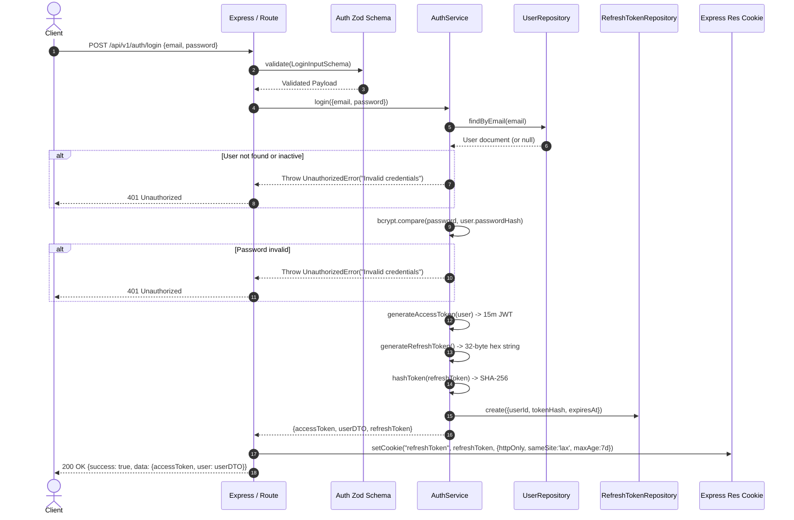
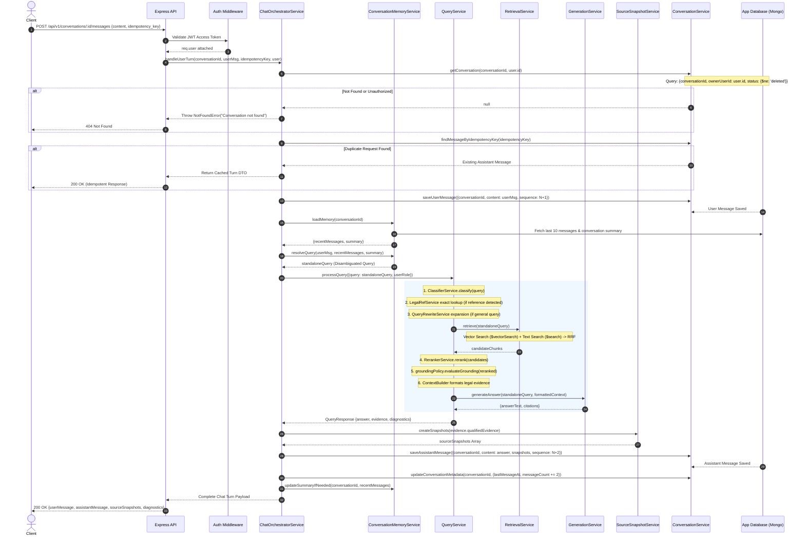

# LegalMind Request Lifecycle & Execution Flows

> **Status**: Implemented
> **Source verified**: `src/modules/auth/*`, `src/modules/conversations/*`, `src/services/chat-orchestrator.service.ts`, `src/services/query.service.ts`
> **Last verified against code**: 2026-07-31

---

## Table of Contents

- [1. Overview](#1-overview)
- [2. Login Request Flow](#2-login-request-flow)
- [3. Create Conversation Flow](#3-create-conversation-flow)
- [4. Send Legal Chat Message Flow (End-to-End RAG)](#4-send-legal-chat-message-flow-end-to-end-rag)
- [5. Continue an Existing Conversation Flow](#5-continue-an-existing-conversation-flow)
- [6. Refresh Access Token Flow](#6-refresh-access-token-flow)
- [7. Comprehensive Failure & Edge-Case Flows](#7-comprehensive-failure--edge-case-flows)
- [8. Related Documentation](#8-related-documentation)

---

## 1. Overview

This document provides a step-by-step trace of how HTTP requests traverse the LegalMind backend, from initial socket connection at the Express entry point to database persistence, provider calls, and final JSON response serialization.

---

## 2. Login Request Flow

**Endpoint**: `POST /api/v1/auth/login`
**Handler**: `src/modules/auth/auth.controller.ts -> login()`
**Service**: `src/modules/auth/auth.service.ts -> login()`

---

## 3. Create Conversation Flow

**Endpoint**: `POST /api/v1/conversations`
**Handler**: `src/modules/conversations/conversation.controller.ts -> createConversation()`
**Service**: `src/modules/conversations/conversation.service.ts -> createConversation()`

1. **Authentication**: `authMiddleware` validates `Authorization: Bearer <token>` and attaches `req.user` (`{id, role, organizationId}`).
2. **Validation**: `createConversationSchema` validates optional initial title or tags.
3. **Identifier Creation**: `ConversationService` generates a unique string `conversationId` (UUID v4 format).
4. **Ownership Assignment**: Ownership fields are explicitly set from `req.user`:
   - `ownerUserId = req.user.id`
   - `organizationId = req.user.organizationId`
   - `status = 'active'`
   - `messageCount = 0`
5. **Persistence**: Saved to `legalmind_app.conversations` collection.
6. **Response**: Returns `201 Created` with the new conversation DTO.

---

## 4. Send Legal Chat Message Flow (End-to-End RAG)

**Endpoint**: `POST /api/v1/conversations/:conversationId/messages`
**Handler**: `src/modules/conversations/conversation.controller.ts -> sendMessage()`
**Orchestrator**: `src/services/chat-orchestrator.service.ts -> handleUserTurn()`

This flow represents the core execution path of LegalMind.

---

## 5. Continue an Existing Conversation Flow

1. **History Loading**: `ConversationMemoryService.loadMemory()` fetches up to the last 10 turns (configurable window) sorted by `sequence ASC`.
2. **Context Resolution**: The user's new message (e.g., *"What is the penalty for violating Article 12?"*) is combined with the conversation summary and recent turns.
3. **Standalone Query Generation**: An LLM query rewrite prompt strips pronouns, resolves ambiguous references (e.g., *"violating Article 12 of the Labor Law"*), and outputs a `standaloneQuery`.
4. **Authority Scoping**: Previous assistant messages in history serve strictly as conversational context—they are **never** treated as primary legal authority during RAG retrieval.

---

## 6. Refresh Access Token Flow

**Endpoint**: `POST /api/v1/auth/refresh-token`
**Handler**: `src/modules/auth/auth.controller.ts -> refresh()`

1. **Cookie Parsing**: Express reads the HTTP-only cookie `refreshToken`.
2. **Hash Computation**: `AuthService.hashToken(token)` computes the SHA-256 hash.
3. **Database Lookup**: `RefreshTokenRepository` queries `legalmind_app.refresh_tokens` for `{tokenHash}`.
4. **Validation Checks**:
   - Check if token exists and `revokedAt` is null.
   - Check if `expiresAt > Date.now()`.
5. **Token Rotation**:
   - The used token is immediately marked as revoked (`revokedAt = new Date()`).
   - A fresh 32-byte hex refresh token is generated and saved.
   - A new 15-minute JWT access token is signed.
6. **Cookie Update**: The new refresh token is set in the HTTP-only cookie. Returns `{accessToken}`.

---

## 7. Comprehensive Failure & Edge-Case Flows

| Failure Scenario | Error Code | HTTP Status | Backend Failure & Recovery Behavior |
|---|---|---|---|
| **MongoDB Unavailable** | `DATABASE_ERROR` | `503 Service Unavailable` | `MongoService` ping fails; readiness probe `/ready` returns `503`. Runtime queries throw DB error caught by global `errorHandler`. |
| **Embedding Provider Down** | `EMBEDDING_PROVIDER_ERROR` | `502 Bad Gateway` | `EmbeddingService` retries 3x via `ProviderHttpService`. If all retries fail, falls back to text search lexical candidates or fails gracefully. |
| **Reranker Unavailable** | `RERANKER_ERROR` | `200 OK (Degraded)` | `RerankerService` catches provider failure and automatically triggers fallback to `heuristicRerank()`, sorting by structural metadata scores. |
| **Generation Provider Timeout**| `GENERATION_TIMEOUT` | `504 Gateway Timeout` | HTTP client hits model timeout limit (15s); user message remains saved in DB (`sequence N`), assistant turn is saved with `status = 'failed'`. |
| **Insufficient Legal Evidence** | `INSUFFICIENT_EVIDENCE` | `200 OK (Refusal)` | `grounding-policy.ts` detects top score `< 0.40`; generation is bypassed and standard Arabic refusal message is returned with 0 citations. |
| **Unauthorized Conversation** | `CONVERSATION_NOT_FOUND` | `404 Not Found` | Querying conversation by `conversationId` and `ownerUserId` returns null. Backend returns `404` to prevent ID enumeration. |
| **Expired Access Token** | `TOKEN_EXPIRED` | `401 Unauthorized` | `authMiddleware` JWT verification throws `TokenExpiredError`. Client receives `401` and triggers refresh flow. |
| **Invalid Refresh Token** | `INVALID_REFRESH_TOKEN` | `401 Unauthorized` | Refresh token lookup fails or hash mismatch; refresh cookie is cleared and user is forced to re-login. |
| **Duplicate Submission** | `IDEMPOTENT_REPLAY` | `200 OK` | `ChatOrchestratorService` matches `idempotencyKey` in `messages` collection and returns existing stored assistant turn without re-running RAG. |

---

## 8. Related Documentation

- [Backend Architecture](BACKEND_ARCHITECTURE.md) - System-wide architectural overview.
- [Auth Architecture](AUTH_ARCHITECTURE.md) - Token security and authentication setup.
- [Conversation Architecture](CONVERSATION_ARCHITECTURE.md) - Conversation memory and sequence management.
- [API Reference](API_REFERENCE.md) - Full endpoint parameter and response DTO schemas.
