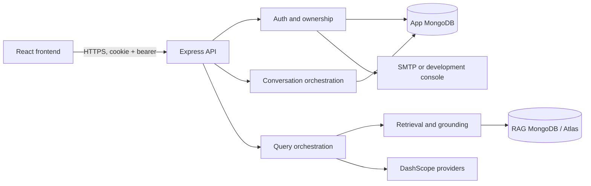

# Backend overview

`backend-ts/src/index.ts` creates a singleton service graph, connects both
databases, then starts Express. A connection failure rejects bootstrap. SIGINT
and SIGTERM stop accepting requests, close Mongo connections, and force exit
after ten seconds if shutdown does not complete.

## Runtime layers

Middleware order is request ID, CORS, 2 MiB JSON parser, cookies, optional
Morgan logging, route handlers, not-found handler, and global error handler.
Auth registration validates a strict JSON body after the route limiter.

App MongoDB stores users, refresh tokens, conversations, and messages. RAG
MongoDB stores legal chunks and governance-change records. They may share a
server but use separately configured connections/databases. Atlas Search and
Vector Search are operator-provisioned and are not created at startup.

Provider configuration exposes a summary and rotates configured API keys
round-robin within each process. Email uses SMTP or console mode.

## Trust boundaries

Browser input, cookies, bearer tokens, stored corpus text, and
provider responses are untrusted. Owner filters protect conversation data.
Governance filters qualify stored legal material; escaped XML and a system
prompt tell the generator not to execute corpus instructions. These controls
reduce risk but do not establish legal correctness.
