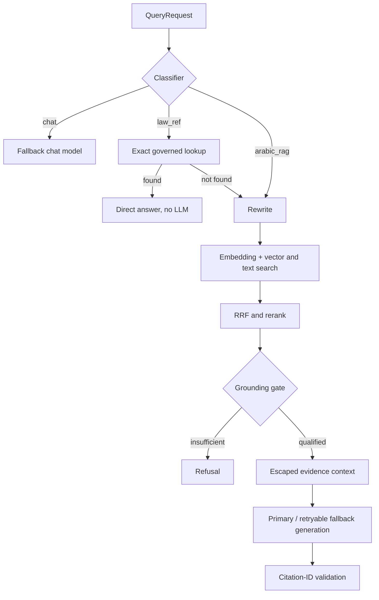

# Legal-query pipeline

`QueryService.runQuery` classifies each request into one of three branches.

Social chat returns no sources and calls only the fallback chat model. It has no
second model fallback.

Exact article/ruling answers are constructed directly from governed MongoDB
documents and return `llm_provider_used=null`. A partial multi-article result
includes found documents and names missing articles. When nothing matches, the
request falls through to RAG with an explanatory prefix.

RAG rewrites with provider/fallback behavior, embeds the rewritten query,
performs vector search and best-effort text search, fuses rankings, reranks,
then grounds. A refusal makes no generation call. Qualified evidence is escaped
into XML, generated against the original question, and citation IDs are
sanitized. `llm_provider_used` is a provider label, not proof a generation call
occurred; refusals also carry it.

`evidence_relevance_score` is the maximum available rerank, similarity, or RRF
score among qualified evidence. It is retrieval relevance only.
