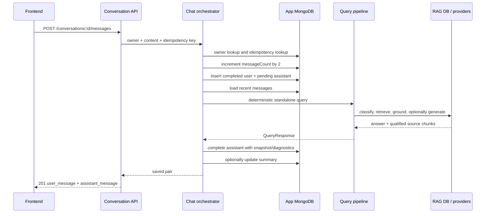

# Request lifecycle

## Common request path

The client sends credentials with every request and a bearer access token when
available. Express assigns `request_id`, enforces exact-origin CORS, parses the
request, authenticates protected routes, applies route-specific limits and
validation, then invokes a controller/service. Expected failures are normalized
to the common error envelope; limiter responses are the exception.

On a protected-request 401, `frontend/src/api.ts` uses one shared refresh
promise, rotates the refresh token through its HTTP-only cookie, then retries
the original request once.

## Saved legal turn

If query processing fails, the assistant becomes `failed` and the API returns
502 with its ID. Retrying with the same key resets a failed assistant to
`pending` and reprocesses it. A completed assistant is returned unchanged. An
already pending assistant is also returned immediately; there is no worker.

Registration differs: an email failure deletes the newly created user.
Password-reset mail failure clears reset
fields and returns the generic response. Reset-confirmation email failure does
not undo an already changed password/session.
