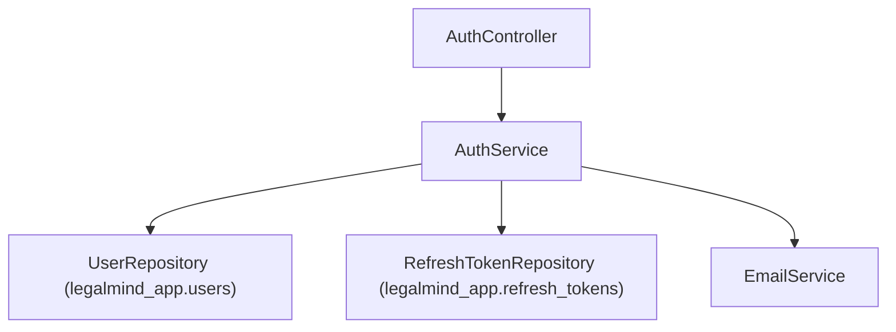

# Auth Service Implementation Guide

> Status: Implemented
> Verified against: `src/modules/auth/auth.service.ts`
> Related services: UserRepository, RefreshTokenRepository, EmailService

---

## Overview

`AuthService` is the central security service responsible for user registration, email verification, authentication credential checks, JWT short-lived access token generation, stateful refresh token rotation, session revocation, and password reset workflows.

---

## Inputs and Outputs

### Constructor Dependencies
- `users: UserRepository`
- `refreshTokens: RefreshTokenRepository`
- `email: EmailService`

### Public Methods

#### `register(input: RegisterInput): Promise<UserDocument>`
* **Inputs**: Registration input (`email`, `password`, `fullName`, `role`).
* **Outputs**: Created Mongoose `UserDocument`.
* **Errors**: Throws `409 Conflict` if email exists; `503` if verification email delivery fails.

#### `login(email: string, password: string, ipAddress?: string)`
* **Outputs**: `{ user, accessToken, refreshToken }`.
* **Errors**: Throws `401 Unauthorized` if credentials invalid; `403` if account unverified/disabled.

#### `refreshToken(rawToken: string, ipAddress?: string)`
* **Outputs**: `{ user, accessToken, refreshToken }` (Rotates token).
* **Errors**: Throws `401` on token reuse (revoking all user sessions).

#### `logout(...)` / `logoutAll(...)` / `forgotPassword(...)` / `resetPassword(...)` / `verifyEmail(...)`

---

## Dependency Diagram

---

## Step-by-Step Runtime Flow

1. **Login**: Verifies email -> compares bcrypt password -> checks `isEmailVerified` & `isActive` -> creates 40-byte hex refresh token -> saves SHA-256 hash in DB -> signs 15-min JWT access token.
2. **Refresh Token Rotation**: Computes SHA-256 hash of incoming refresh token -> checks `refresh_tokens` DB -> if already used, revokes all user sessions (reuse detection) -> rotates token to new 40-byte hex value -> signs new JWT access token.

---

## Function-by-Function Analysis

### `generateAccessToken(user: UserDocument): string`
Signs a 15-minute JWT access token using `HS256`, `jwtSecret`, issuer `legalmind-api`, and audience `legalmind-web`.

### `verifyAccessToken(token: string): AccessTokenPayload`
Verifies JWT signature and parses payload with Zod schema `accessTokenPayloadSchema`.

### `refreshToken(rawToken: string, ipAddress?: string)`
Handles stateful token rotation and reuse detection security rules.

---

## Configuration
Controlled by environment variables in `env`:
- `LEGALMIND_JWT_SECRET`
- `LEGALMIND_JWT_ACCESS_EXPIRES_IN` (default: `15m`)
- `LEGALMIND_REFRESH_TOKEN_DAYS` (default: `7`)

---

## Database Interaction
Read/write operations on `legalmind_app.users` and `legalmind_app.refresh_tokens`.

---

## Security Implications
* Refresh tokens are stored as SHA-256 hashes.
* Token reuse triggers security wipe of all active user sessions.
* Passwords are default salted with 12 rounds of bcrypt.

---

## Known Limitations

### Current implementation
* Access token revocation relies on short 15-minute expiration window.

### Recommended future improvement
* Support Redis-backed access token blacklist for instant token revocation.

---

## Tests
* Unit test: `src/auth-tests/auth.unit.test.ts`
* Integration test: `src/auth-tests/auth.integration.test.ts`

---

## Related Files and Call Sites

* Primary source: `src/modules/auth/auth.service.ts`
* Callers: `src/modules/auth/auth.controller.ts`, `src/modules/auth/auth.middleware.ts`
* Architecture: [Auth Architecture](../AUTH_ARCHITECTURE.md)
