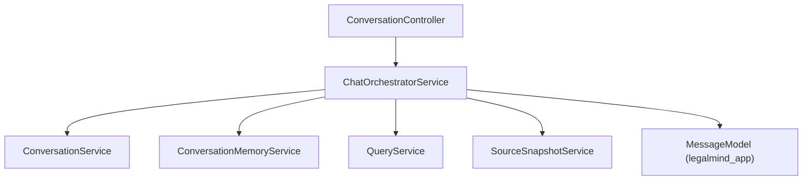

# Chat Orchestrator Service Implementation Guide

> Status: Implemented
> Verified against: `src/services/chat-orchestrator.service.ts`
> Related services: ConversationService, ConversationMemoryService, SourceSnapshotService, QueryService

---

## Overview

`ChatOrchestratorService` executes stateful chat turns. It enforces idempotency keys, allocates atomic sequence numbers, persists user turn messages, triggers conversation memory query resolution, executes the RAG pipeline via `QueryService`, creates frozen source snapshots, updates summaries, and handles chat turn failure states cleanly.

---

## Inputs and Outputs

### Constructor Dependencies
- `conversations: ConversationService`
- `memory: ConversationMemoryService`
- `snapshots: SourceSnapshotService`
- `queryService: QueryService`

### Public Methods

#### `sendMessage(conversationId: string, owner: ConversationOwner, input: SendConversationMessageInput)`
* **Inputs**: Target thread ID, authenticated owner identity, payload (`content`, `idempotency_key`, `top_k`, `user_role`).
* **Outputs**: Object containing `{ userMessage, assistantMessage }`.
* **Errors**: Throws `409` on idempotency conflict; `404` if thread missing; `502` if assistant generation fails (preserving user message).

---

## Dependency Diagram

---

## Step-by-Step Runtime Flow

1. Checks `idempotencyKey` against `messages` collection. If duplicate exists, calls `resumeOrReturnExisting()`.
2. Atomically increments `messageCount` by 2 on thread document (`$inc: { messageCount: 2 }`).
3. Saves user message (`role: 'user'`, `sequence: N-1`, `status: 'completed'`).
4. Creates pending assistant message (`role: 'assistant'`, `sequence: N`, `status: 'pending'`).
5. Loads recent history and resolves standalone query via `ConversationMemoryService`.
6. Executes RAG search and generation via `QueryService.runQuery()`.
7. Converts evidence chunks to immutable snapshots via `SourceSnapshotService`.
8. Updates assistant message to `status: 'completed'` with generated content and diagnostics.
9. Asynchronously updates conversation summary via `memory.updateSummaryIfNeeded()`.

---

## Function-by-Function Analysis

### `sendMessage(...)`
Main orchestration method handling atomic turn reservation, idempotency checks, and execution.

### `resumeOrReturnExisting(...)`
Replay handler for network retries with matching idempotency keys.

### `processAssistant(...)`
Private worker method handling memory resolution, RAG query execution, source snapshot creation, and error logging.

---

## Configuration
Controlled by environment variables in `env`: `llmModel`.

---

## Database Interaction
Read/write operations on `legalmind_app.conversations` and `legalmind_app.messages`.

---

## Security Implications
* Prevents message sequence corruption and duplicate requests via idempotency checks.
* Preserves user turn when LLM generation fails, returning explicit error metadata (`CHAT_GENERATION_FAILED`).

---

## Known Limitations

### Current implementation
* Executes memory resolution and RAG search synchronously within HTTP request cycle.

---

## Tests
* Integration test: `src/chat-tests/conversation.integration.test.ts`

---

## Related Files and Call Sites

* Primary source: `src/services/chat-orchestrator.service.ts`
* Callers: `src/modules/conversations/conversation.controller.ts`
* Dependencies: [ConversationService](CONVERSATION_SERVICE_IMPLEMENTATION.md), [ConversationMemoryService](CONVERSATION_MEMORY_IMPLEMENTATION.md), [QueryService](QUERY_SERVICE_IMPLEMENTATION.md), [SourceSnapshotService](SOURCE_SNAPSHOT_IMPLEMENTATION.md)
