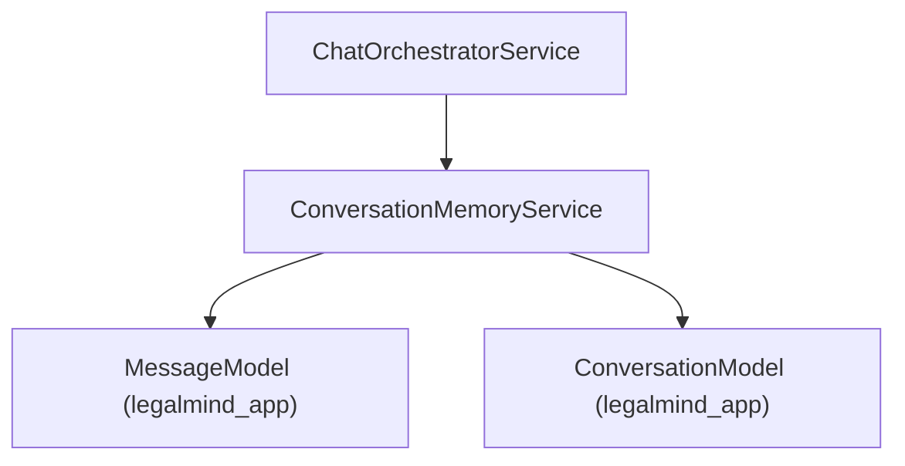

# Conversation Memory Service Implementation Guide

> Status: Implemented
> Verified against: `src/services/conversation-memory.service.ts`
> Related services: ChatOrchestratorService, QueryService

---

## Overview

`ConversationMemoryService` handles multi-turn conversation memory, pronoun resolution, and summary updating. It loads windowed message histories, disambiguates follow-up messages into standalone queries, and updates thread summary progression as thread length grows.

---

## Inputs and Outputs

### Constructor Dependencies
None.

### Public Methods

#### `resolve(input: { summary: string; activeLegalContext: ActiveLegalContext; recentMessages: Message[]; currentMessage: string }): Promise<ConversationRewriteResult>`
* **Inputs**: Summary text, active legal context, recent turn array, current raw user message.
* **Outputs**: `ConversationRewriteResult` (`isFollowUp`, `standaloneQuery`, `referencedAuthorities`, `referencedFacts`, `needsClarification`).

#### `loadRecentMessages(conversationId: string, ownerUserId: string, organizationId: string | null, limit?: number): Promise<Message[]>`
* **Outputs**: Array of recent `Message` documents sorted by `sequence ASC`.

#### `updateSummaryIfNeeded(conversationId: string, ownerUserId: string, organizationId: string | null): Promise<void>`
* **Outputs**: Updates `summary` and `summaryVersion` on thread document if message count % 12 === 0 or context character count exceeds 8000.

---

## Dependency Diagram

---

## Step-by-Step Runtime Flow

1. Checks current message against `followUpPattern` regex (e.g. *"وماذا عن"*, *"وهل"*, *"what about"*).
2. If follow-up detected, prepends previous user message context to generate `standaloneQuery`.
3. Validates output schema via Zod `conversationRewriteResultSchema`.
4. When `updateSummaryIfNeeded()` runs, checks if total message count or character count threshold is exceeded.
5. Assembles running summary of user objectives, provided facts, and unresolved questions without treating prior assistant messages as legal authority.

---

## Function-by-Function Analysis

### `resolve(...)`
Disambiguates follow-up messages into standalone RAG retrieval queries.

### `loadRecentMessages(...)`
Loads up to 12 recent messages sorted chronologically by sequence.

### `updateSummaryIfNeeded(...)`
Progressively updates conversation thread summary metadata.

---

## Configuration
No environment variables required.

---

## Database Interaction
Read/write operations on `legalmind_app.conversations` and `legalmind_app.messages`.

---

## Security Implications
* Disambiguated queries are validated via Zod schema to prevent unexpected type mutations.

---

## Known Limitations

### Current implementation
* Rule-based follow-up detection uses pattern regex; full LLM context rewrite is planned for complex multi-turn shifts.

---

## Tests
* Unit test: `src/chat-tests/conversation.unit.test.ts`

---

## Related Files and Call Sites

* Primary source: `src/services/conversation-memory.service.ts`
* Callers: [ChatOrchestratorService](CHAT_ORCHESTRATOR_IMPLEMENTATION.md)
