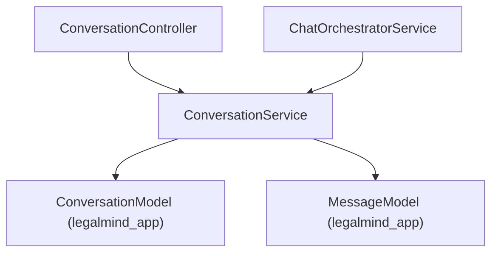

# Conversation Service Implementation Guide

> Status: Implemented
> Verified against: `src/modules/conversations/conversation.service.ts`
> Related services: ChatOrchestratorService, ConversationMemoryService

---

## Overview

`ConversationService` manages stateful CRUD operations for thread metadata (`conversations` collection) and message history (`messages` collection). It enforces user ownership scoping, cursor-based pagination, message sequence sorting, and soft-deletion policies.

---

## Inputs and Outputs

### Constructor Dependencies
None.

### Public Methods

#### `create(owner: ConversationOwner, input: { title?: string; user_role?: 'lawyer' | 'citizen' })`
* **Inputs**: Authenticated user identity (`id`, `organizationId`), optional title and role.
* **Outputs**: Created Mongoose `ConversationModel` document.

#### `list(owner: ConversationOwner, input: { cursor?: string; limit: number; status: 'active' | 'archived' })`
* **Outputs**: Paginated list of thread summaries + `nextCursor`.

#### `get(conversationId: string, owner: ConversationOwner)`
* **Outputs**: Thread document. Throws `404` if not found or owned by another user.

#### `listMessages(conversationId: string, owner: ConversationOwner, input: { cursor?: string; limit: number })`
* **Outputs**: Array of `Message` DTOs sorted by `sequence ASC`.

#### `update(...)` / `softDelete(...)`

---

## Dependency Diagram

---

## Step-by-Step Runtime Flow

1. Extracts `ownerUserId` and `organizationId` from authenticated `req.user`.
2. Appends `ownershipFilter` (`ownerUserId`, `status: { $ne: 'deleted' }`) to all database queries.
3. For paginated queries, decodes base64url cursors and applies `$gt` / `$lt` range filters.
4. Executes Mongoose atomic updates for title/status changes or soft deletion (`status = 'deleted'`).

---

## Function-by-Function Analysis

### `ownershipFilter(conversationId: string, owner: ConversationOwner)`
Generates standard Mongoose filter enforcing user ownership and soft deletion exclusion.

### `create(...)`
Initializes a new conversation thread with UUID v4 identifier, default title, zero message count, and empty active legal context.

### `list(...)`
Returns user conversation threads sorted by `lastMessageAt DESC` with base64url cursor pagination.

### `softDelete(...)`
Marks conversation `status = 'deleted'` and sets `deletedAt` timestamp without destroying historical chat data.

---

## Configuration
No environment variables required.

---

## Database Interaction
Read/write operations on `legalmind_app.conversations` and `legalmind_app.messages`.

---

## Security Implications
* Prevents cross-user conversation access by enforcing `ownerUserId` filter.
* Throws `404 Not Found` for unauthorized access requests.

---

## Known Limitations

### Current implementation
* Hard deletion (permanent purge) is not implemented in current build.

### Recommended future improvement
* Implement background cron job to hard-delete soft-deleted threads older than 90 days.

---

## Tests
* Unit test: `src/chat-tests/conversation.unit.test.ts`
* Integration test: `src/chat-tests/conversation.integration.test.ts`

---

## Related Files and Call Sites

* Primary source: `src/modules/conversations/conversation.service.ts`
* Callers: [ChatOrchestratorService](CHAT_ORCHESTRATOR_IMPLEMENTATION.md), `src/modules/conversations/conversation.controller.ts`
* Models: [ConversationModel](../database/CONVERSATION_MODEL.md), [MessageModel](../database/MESSAGE_MODEL.md)
