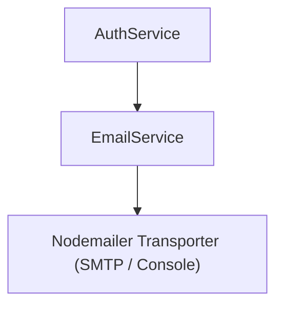

# Email Service Implementation Guide

> Status: Implemented
> Verified against: `src/services/email.service.ts`
> Related services: AuthService

---

## Overview

`EmailService` handles transactional email notifications for user email verification and password resets using Nodemailer. It supports two modes:
1. `console`: Development mode logging action URLs directly to standard output.
2. `smtp`: Production mode delivering HTML emails via configured SMTP host and credentials.

---

## Inputs and Outputs

### Constructor Dependencies
- Optional `mode?: 'console' | 'smtp'` (defaults to `env.emailMode`).

### Public Methods

#### `sendVerificationEmail(to: string, token: string, fullName: string): Promise<void>`
* **Outputs**: Dispatches verification email containing action URL `${frontendUrl}/verify-email?token=...`.

#### `sendPasswordResetEmail(to: string, token: string, fullName: string): Promise<void>`
* **Outputs**: Dispatches password reset email containing action URL `${frontendUrl}/reset-password?token=...`.

#### `sendPasswordResetConfirmation(to: string, fullName: string): Promise<void>`
#### `getLastDevelopmentEmail(): DevelopmentEmail | null`

---

## Dependency Diagram

---

## Step-by-Step Runtime Flow

1. Escapes HTML entities (`escapeHtml`) in user full name to prevent HTML injection in emails.
2. Constructs action URL pointing to frontend route.
3. Checks operational mode:
   - If `console`, stores email details in `lastDevelopmentEmail` for integration testing and logs to stdout.
   - If `smtp`, instantiates Nodemailer SMTP transporter and sends email.

---

## Function-by-Function Analysis

### `sendVerificationEmail(...)`
Generates email verification token link (24-hour expiration).

### `sendPasswordResetEmail(...)`
Generates password reset token link (1-hour expiration).

### `getTransporter()`
Lazy-initializes Nodemailer SMTP transporter.

---

## Configuration
Controlled by environment variables in `env`:
- `LEGALMIND_EMAIL_MODE` (default: `console`)
- `LEGALMIND_EMAIL_FROM`
- `LEGALMIND_EMAIL_HOST`
- `LEGALMIND_EMAIL_PORT` (default: `587`)
- `LEGALMIND_EMAIL_SECURE` (default: `false`)
- `LEGALMIND_EMAIL_USER`
- `LEGALMIND_EMAIL_PASSWORD`

---

## Database Interaction
None.

---

## Security Implications
* Escapes HTML characters in full name string to prevent XSS/HTML injection in email clients.

---

## Known Limitations

### Current implementation
* Console mode suppresses actual email delivery in local development.

---

## Tests
* Unit test: `src/auth-tests/auth.unit.test.ts`

---

## Related Files and Call Sites

* Primary source: `src/services/email.service.ts`
* Callers: [AuthService](AUTH_SERVICE_IMPLEMENTATION.md)
