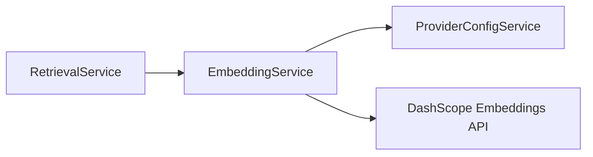

# Embedding Service Implementation Guide

> Status: Implemented
> Verified against: `src/services/embedding.service.ts`
> Related services: RetrievalService, ProviderConfigService, ProviderHttpService

---

## Overview

`EmbeddingService` interfaces with the Alibaba Cloud DashScope API (`text-embedding-v4`) to generate 1024-dimensional dense vector embeddings for query texts and legal chunk documents.

---

## Inputs and Outputs

### Constructor Dependencies
- `providerConfigService: ProviderConfigService`

### Public Methods

#### `embedQuery(text: string): Promise<number[]>`
* **Inputs**: Query text string.
* **Outputs**: Array of 1024 finite floating-point numbers.
* **Errors**: Throws if API response is empty, count mismatches, or vector dimensions != 1024.

#### `embedDocuments(texts: string[]): Promise<number[][]>`
* **Inputs**: Array of legal chunk text strings.
* **Outputs**: Array of 1024-dimensional vectors.

---

## Dependency Diagram

---

## Step-by-Step Runtime Flow

1. Trims and sanitizes input texts.
2. Retrieves round-robin API key via `ProviderConfigService.getDashScopeApiKey()`.
3. Issues HTTP POST request to `${baseUrl}/embeddings` using `requestProviderText()`.
4. Parses JSON response supporting both MaaS native (`output.embeddings`) and OpenAI-compatible (`data`) response formats.
5. Validates that every returned vector contains exactly 1024 finite numbers (`env.embeddingDim`).
6. Returns embedding vectors.

---

## Function-by-Function Analysis

### `embedQuery(text: string): Promise<number[]>`
Generates a query-type vector (`input_type: 'query'`).

### `embedDocuments(texts: string[]): Promise<number[][]>`
Generates document-type vectors (`input_type: 'document'`) for corpus batch ingestion.

### `embed(texts: string[], inputType: DashScopeEmbeddingInputType): Promise<number[][]>`
Private implementation method handling HTTP requests, parsing, retry budgets (35s), and dimension validation.

---

## Configuration
Controlled by environment variables in `env`:
- `LEGALMIND_EMBEDDING_MODEL` (default: `text-embedding-v4`)
- `LEGALMIND_EMBEDDING_DIM` (default: `1024`)

---

## Database Interaction
None (External API processing).

---

## Security Implications
* Sanitize raw API keys in HTTP headers.
* Validates vector dimensions before executing MongoDB `$vectorSearch` to prevent database index errors.

---

## Known Limitations

### Current implementation
* HTTP request batching relies on DashScope input array limits.

### Recommended future improvement
* Implement automatic client-side chunking for large document arrays (> 25 texts).

---

## Tests
* Unit test: `src/security-tests/provider-http.unit.test.ts`

---

## Related Files and Call Sites

* Primary source: `src/services/embedding.service.ts`
* Consumers: [RetrievalService](RETRIEVAL_SERVICE_IMPLEMENTATION.md)
* Scripts: `src/scripts/reembed-legal-chunks.ts`
