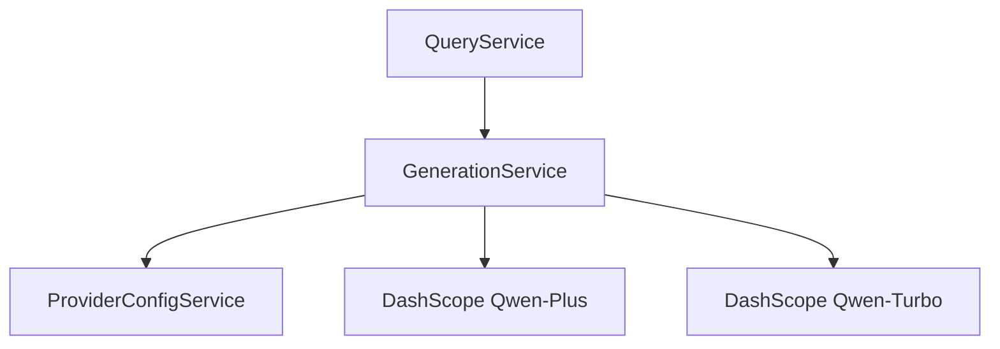

# Generation Service Implementation Guide

> Status: Implemented
> Verified against: `src/services/generation.service.ts`
> Related services: QueryService, ProviderConfigService, ProviderHttpService

---

## Overview

`GenerationService` manages LLM prompt assembly and text generation via Alibaba Cloud DashScope (`qwen-plus` primary, `qwen-turbo` fallback). It enforces strict system prompts prohibiting hallucinated laws, requiring bracketed citations `[S1]`, and isolating untrusted evidence blocks.

---

## Inputs and Outputs

### Constructor Dependencies
- `providerConfigService: ProviderConfigService`

### Public Methods

#### `generateGroundedArabicAnswer(params: GroundedArabicAnswerParams): Promise<string>`
* **Inputs**: `{ question, context, evidenceCount }`.
* **Outputs**: Grounded Arabic text response with source citations.
* **Errors**: Falls back to `llmModelFallback` if primary model call fails.

#### `generateChatAnswer(question: string): Promise<string>`
* **Inputs**: Conversational user question string.
* **Outputs**: Brief polite Arabic response.

---

## Dependency Diagram

---

## Step-by-Step Runtime Flow

1. Retrieves active API key and model config from `ProviderConfigService`.
2. Formats `GROUNDED_SYSTEM_PROMPT` containing anti-hallucination rules and untrusted evidence delimiters (`<legal_evidence>`).
3. Sends POST request to `${baseUrl}/chat/completions` with 30s timeout (`GENERATION_TIMEOUT_MS`).
4. If primary model (`qwen-plus`) throws a retryable HTTP error, catches exception and attempts generation with fallback model (`qwen-turbo`).
5. Extracts answer text from choice array and returns response string.

---

## Function-by-Function Analysis

### `generateGroundedArabicAnswer(...)`
Primary RAG generation entry point with automated fallback execution.

### `generateChatAnswer(...)`
Conversational greeting handler using `CHAT_SYSTEM_PROMPT` and lower token limit (512 tokens).

### `extractAnswerText(...)`
Parses string or multi-part content arrays from DashScope API JSON responses.

---

## Configuration
Controlled by environment variables in `env`:
- `LEGALMIND_LLM_MODEL` (default: `qwen-plus`)
- `LEGALMIND_LLM_MODEL_FALLBACK` (default: `qwen-turbo`)

---

## Database Interaction
None.

---

## Security Implications
* Wraps evidence in `<legal_evidence>` tags with explicit system instructions disallowing prompt injection overrides.

---

## Known Limitations

### Current implementation
* Streaming completion (SSE) is not enabled in backend.

### Recommended future improvement
* Support streaming token output for UI rendering.

---

## Tests
* Unit test: `src/security-tests/provider-http.unit.test.ts`

---

## Related Files and Call Sites

* Primary source: `src/services/generation.service.ts`
* Consumers: [QueryService](QUERY_SERVICE_IMPLEMENTATION.md)
* Utilities: [Citation Validator](../utilities/CITATION_VALIDATOR.md)
