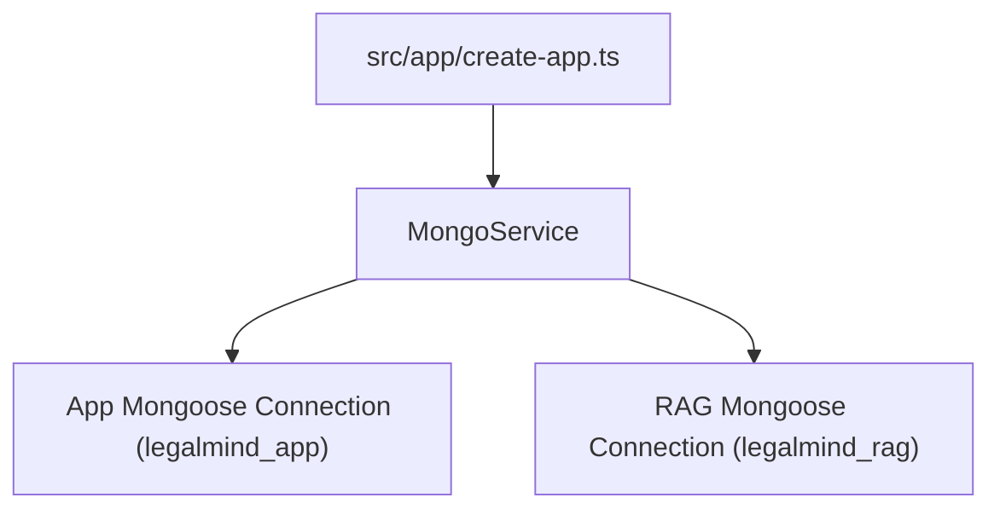

# Mongo Service Implementation Guide

> Status: Implemented
> Verified against: `src/services/mongo.service.ts`
> Related services: ServiceContainer, App & RAG Models

---

## Overview

`MongoService` manages parallel Mongoose connection instances for the dual-database architecture:
1. `appConnection`: Handles `legalmind_app` database (users, tokens, conversations, messages).
2. `ragConnection`: Handles `legalmind_rag` database (legal chunks, Atlas search indexes).

---

## Inputs and Outputs

### Constructor Dependencies
None.

### Public Methods

#### `connect(): Promise<void>`
* **Outputs**: Opens connections to `legalmind_app` and `legalmind_rag` in parallel.
* **Errors**: Aborts startup cleanly if connection fails within timeout.

#### `health(): Promise<MongoHealth>`
* **Outputs**: `{ app: { connected, pingOk, database }, rag: { connected, pingOk, database } }`.

#### `close(): Promise<void>`
* **Outputs**: Gracefully closes both database connections.

---

## Dependency Diagram

---

## Step-by-Step Runtime Flow

1. Called by `createApp()` during Express app initialization.
2. Checks connection `readyState` (0 = disconnected, 1 = connected, 2 = connecting).
3. Opens parallel connections with configured connection pool settings (`maxPoolSize`, `connectTimeoutMS`).
4. Used by `/ready` endpoint to issue `{ ping: 1 }` commands across both connection instances.

---

## Function-by-Function Analysis

### `connect(): Promise<void>`
Establishes parallel connections to app and RAG MongoDB instances.

### `health(): Promise<MongoHealth>`
Executes admin ping commands against both databases for readiness probing.

### `close(): Promise<void>`
Gracefully disconnects both database connections during server shutdown.

---

## Configuration
Controlled by environment variables in `env`:
- `LEGALMIND_APP_URI`, `LEGALMIND_APP_DB`
- `LEGALMIND_RAG_URI`, `LEGALMIND_RAG_DB`
- `LEGALMIND_MONGO_CONNECT_TIMEOUT_MS` (default: `10000`)
- `LEGALMIND_MONGO_MAX_POOL_SIZE` (default: `10`)

---

## Database Interaction
Manages raw `mongoose.Connection` instances.

---

## Security Implications
* Decouples transactional application data from vector RAG corpus connections.

---

## Known Limitations

### Current implementation
* Uses standard Mongoose `createConnection()`; single global pool per database.

---

## Tests
* Unit test: `src/security-tests/error-handling.unit.test.ts`

---

## Related Files and Call Sites

* Primary source: `src/services/mongo.service.ts`
* Callers: `src/app/create-app.ts`, `src/routes/health.ts`
* Architecture: [Database Architecture](../DATABASE_ARCHITECTURE.md)
