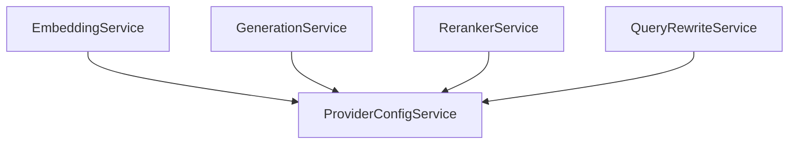

# Provider Config Service Implementation Guide

> Status: Implemented
> Verified against: `src/services/provider-config.service.ts`
> Related services: EmbeddingService, GenerationService, QueryRewriteService, RerankerService

---

## Overview

`ProviderConfigService` manages Alibaba Cloud DashScope provider settings and executes round-robin API key rotation across configured keys (`LEGALMIND_DASHSCOPE_API_KEYS`) to balance rate limits and quotas.

---

## Inputs and Outputs

### Constructor Dependencies
None.

### Public Methods

#### `getSummary(): ProviderSummary`
* **Outputs**: Provider summary metadata (`llmProvider`, `baseUrl`, `llmModel`, `embeddingModel`, `configuredKeys`).

#### `getDashScopeApiKey(): string`
* **Outputs**: Next available API key in round-robin sequence.
* **Errors**: Throws if 0 API keys are configured in environment.

---

## Dependency Diagram

---

## Step-by-Step Runtime Flow

1. Called by LLM provider services when issuing an HTTP request.
2. Increments internal counter `keyIndex`.
3. Returns key at `keyIndex % keys.length`.

---

## Function-by-Function Analysis

### `getDashScopeApiKey(): string`
Cycles through configured API keys in round-robin sequence.

---

## Configuration
Controlled by environment variables in `env`:
- `LEGALMIND_DASHSCOPE_API_KEYS` (comma-separated list of keys)

---

## Database Interaction
None.

---

## Security Implications
* Prevents API keys from being logged in raw text.

---

## Tests
* Unit test: `src/security-tests/provider-http.unit.test.ts`

---

## Related Files and Call Sites

* Primary source: `src/services/provider-config.service.ts`
* Consumers: All LLM provider services
