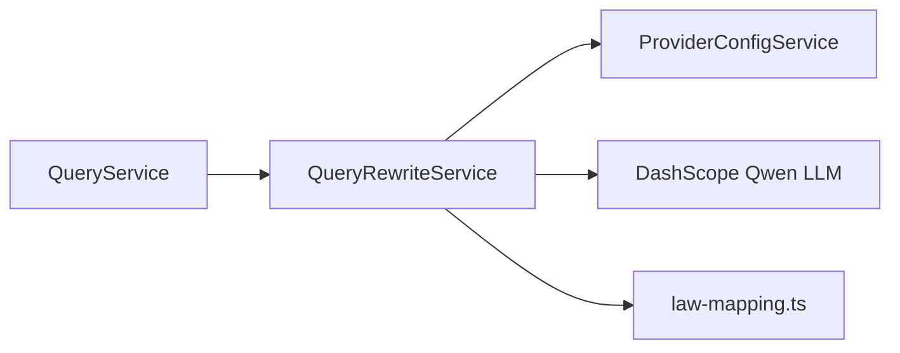

# Query Rewrite Service Implementation Guide

> Status: Implemented
> Verified against: `src/services/query-rewrite.service.ts`
> Related services: QueryService, ProviderConfigService, ProviderHttpService

---

## Overview

`QueryRewriteService` standardizes and expands Egyptian legal queries prior to hybrid search retrieval. It converts colloquial phrasing into formal legal terminology using the Qwen LLM (`qwen-turbo`) or a deterministic Arabic normalization dictionary (`law-mapping.ts`).

---

## Inputs and Outputs

### Constructor Dependencies
- `providerConfigService: ProviderConfigService`

### Public Methods

#### `rewrite(query: string, userRole?: 'lawyer' | 'citizen'): Promise<RewriteResult>`
* **Inputs**: Raw query string, optional user role.
* **Outputs**: `RewriteResult` (`originalQuery`, `rewrittenQuery`, `usedMapping`, `usedLlm`, `mappingMatch`).
* **Errors**: None (Catches internal exceptions and falls back cleanly).

---

## Dependency Diagram

---

## Step-by-Step Runtime Flow

1. Checks `userRole`. If `role === 'lawyer'` and legacy mapping is disabled, returns raw query.
2. If `enableQueryRewrite` or `enableLlmRewrite` is false, runs `deterministicFallback()`.
3. Calls DashScope API (`qwen-turbo`) with system prompt prohibiting invention of law/article numbers.
4. If LLM call succeeds and output length is valid (<= 2000 chars), merges mapping dictionary if enabled.
5. If LLM call times out (8s limit) or fails, catches error and returns `deterministicFallback()`.

---

## Function-by-Function Analysis

### `rewrite(query: string, userRole?: 'lawyer' | 'citizen'): Promise<RewriteResult>`
Main public entry point. Handles role checks, LLM invocation, fallback routing, and output validation.

### `deterministicFallback(query: string): RewriteResult`
Runs `arabic-normalize.ts` and `law-mapping.ts` without making external network calls.

### `rewriteWithLlm(query: string): Promise<string>`
Issues HTTP POST request to DashScope compatible endpoint (`/chat/completions`) with temperature 0.

---

## Configuration
Controlled by environment variables in `env`:
- `LEGALMIND_ENABLE_QUERY_REWRITE` (default: `true`)
- `LEGALMIND_ENABLE_LLM_REWRITE` (default: `true`)
- `LEGALMIND_LLM_REWRITE_MODEL` (default: `qwen-turbo`)
- `LEGALMIND_ENABLE_LEGACY_LAW_MAPPING` (default: `false`)

---

## Database Interaction
None (In-memory & API processing).

---

## Security Implications
* Prevents prompt injection by setting temperature to 0 and explicitly instructing model to return ONLY the rewritten question.

---

## Known Limitations

### Current implementation
* Standard rewrite timeout is 8,000ms.

### Recommended future improvement
* Cache rewritten queries for identical user inputs using LRU cache to reduce LLM API calls.

---

## Tests
* Unit test: `src/query-tests/legal-query.unit.test.ts`

---

## Related Files and Call Sites

* Primary source: `src/services/query-rewrite.service.ts`
* Consumers: [QueryService](QUERY_SERVICE_IMPLEMENTATION.md)
* Utilities: [Arabic Normalization](../utilities/ARABIC_NORMALIZATION.md), [Law Mapping](../utilities/LAW_MAPPING.md)
