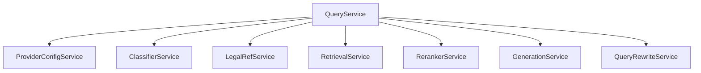

# Query Service Implementation Guide

> Status: Implemented
> Verified against: `src/services/query.service.ts`
> Related services: ClassifierService, LegalRefService, RetrievalService, RerankerService, GenerationService, QueryRewriteService, ProviderConfigService

---

## Overview

`QueryService` is the primary RAG orchestrator in LegalMind. It receives incoming user query requests and controls the execution flow across classification, exact legal reference lookup, query rewriting, hybrid search retrieval, LLM reranking, grounding policy validation, context building, and answer generation.

---

## Inputs and Outputs

### Constructor Dependencies
- `providerConfigService: ProviderConfigService`
- `classifierService: ClassifierService`
- `legalRefService: LegalRefService`
- `retrievalService: RetrievalService`
- `rerankerService: RerankerService`
- `generationService: GenerationService`
- `queryRewriteService: QueryRewriteService`

### Public Methods

#### `runQuery(request: QueryRequest): Promise<QueryResponse>`
* **Inputs**: `QueryRequest` (`query`, `top_k`, `user_role`, etc.)
* **Outputs**: `QueryResponse` (`answer`, `source_chunks`, `llm_provider_used`, `category`, `latency_ms`, `evidence_relevance_score`)
* **Side Effects**: Reads from MongoDB RAG collections; calls DashScope LLM/Reranker APIs.

---

## Dependency Diagram

---

## Step-by-Step Runtime Flow

1. **Classification**: Invokes `ClassifierService.classify(request)`.
2. **Chat Branch**: If `category === 'chat'`, calls `GenerationService.generateChatAnswer()`.
3. **Law Reference Branch**: If `category === 'law_ref'`, calls `runLawReference()`.
   - Attempts exact lookup via `RetrievalService.findByArticle()` or `findByAppeal()`.
   - If match found, formats exact answer via `LegalRefService.buildExactMatchAnswer()`.
   - If missing, falls back to `runRag()`.
4. **RAG Branch**: Invokes `runRag()`.
   - Executes LLM query expansion via `QueryRewriteService.rewrite()`.
   - Merges legal references from original and rewritten queries.
   - Fetches candidate chunks via `RetrievalService.retrieveCandidateChunks()`.
   - Re-scores candidates via `RerankerService.rerank()`.
   - Validates grounding via `evaluateGrounding()`. If score `< 0.40`, returns Arabic refusal answer.
   - Formats evidence via `buildArabicLegalContext()`.
   - Generates grounded answer via `GenerationService.generateGroundedArabicAnswer()`.
   - Validates citations via `validateSourceCitations()`.

---

## Function-by-Function Analysis

### `runQuery(request: QueryRequest): Promise<QueryResponse>`
Main entry point for standalone queries. Routes request to chat, exact reference, or general RAG path.

### `runLawReference(...)`
Handles deterministic legal reference and cassation appeal lookup. Includes fallback to hybrid RAG if exact reference is not found in corpus.

### `runRag(...)`
Executes full hybrid RAG pipeline: rewrite -> search -> RRF -> rerank -> grounding -> context -> LLM generation -> citation validation.

---

## Configuration
Controlled by environment variables in `env`: `rerankTopK`, `enableLlmRerank`, `enableQueryRewrite`.

---

## Database Interaction
Read-only queries against `legalmind_rag.legal_chunks` via `RetrievalService`.

---

## Security Implications
* Validates citations to prevent fabricated source brackets.
* Strips prompt injection commands via grounding policy.

---

## Known Limitations

### Current implementation
* Executes sequentially for single requests; batch query optimization is not supported.

### Recommended future improvement
* Support asynchronous pipeline streaming (Server-Sent Events) for real-time answer rendering.

---

## Tests
* Unit test: `src/query-tests/legal-query.unit.test.ts`

---

## Related Files and Call Sites

* Primary source: `src/services/query.service.ts`
* Callers: [ChatOrchestratorService](CHAT_ORCHESTRATOR_IMPLEMENTATION.md), `src/controllers/query.controller.ts`
