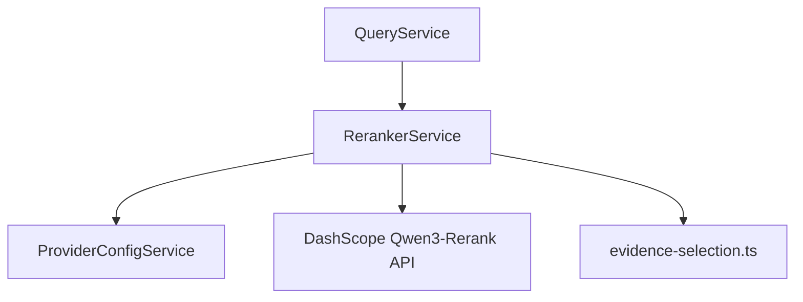

# Reranker Service Implementation Guide

> Status: Implemented with known limitations
> Verified against: `src/services/reranker.service.ts`
> Related services: QueryService, ProviderConfigService, ProviderHttpService

---

## Overview

`RerankerService` re-orders retrieved candidate chunks by semantic relevance. It attempts to call the DashScope cross-encoder reranking endpoint (`qwen3-rerank`). If the API call fails or is disabled via configuration, it automatically executes a zero-latency heuristic fallback (`rerankHeuristic()`).

---

## Inputs and Outputs

### Constructor Dependencies
- `providerConfigService: ProviderConfigService`

### Public Methods

#### `rerank(question: string, chunks: LegalChunks[], topK: number): Promise<LegalChunks[]>`
* **Inputs**: Natural language user question, candidate `LegalChunks` array, target `topK` limit.
* **Outputs**: Array of `LegalChunks` populated with `rerank_score` (0.0 to 1.0) and `evidence_rank`.
* **Errors**: Catches LLM exceptions and falls back cleanly to heuristic scoring.

---

## Dependency Diagram

---

## Step-by-Step Runtime Flow

1. Deduplicates candidate chunks via `deduplicateEvidence()`.
2. If `enableLlmRerank` is true, calls `rerankWithLlm()`.
3. Issues HTTP POST to DashScope rerank endpoint (`/reranks`) with query and enriched document strings.
4. Validates API response via `validateRerankResults()`.
5. If API succeeds, attaches `rerank_score` and returns top K.
6. If API fails, times out (10s limit), or is disabled, catches exception and logs error.
7. Executes `rerankHeuristic()`, scoring chunks synchronously using metadata matches and structural relevance.

---

## Function-by-Function Analysis

### `rerank(...)`
Primary public method orchestrating LLM vs heuristic fallback decision.

### `rerankWithLlm(...)`
Constructs cross-encoder payload, enriches document strings with law name and article headers, issues network call, and parses relevance scores.

### `rerankHeuristic(...)`
Synchronous fallback scorer utilizing `scoreEvidenceChunk()` from `evidence-selection.ts`.

---

## Configuration
Controlled by environment variables in `env`:
- `LEGALMIND_ENABLE_LLM_RERANK` (default: `true`)
- `LEGALMIND_LLM_RERANK_MODEL` (default: `qwen3-rerank`)

---

## Database Interaction
None.

---

## Security Implications
* Validates returned payload indexes to prevent out-of-bounds memory array accesses.

---

## Known Limitations

### Current implementation
* Cross-encoder payload enrichment adds minor string formatting overhead.

### Recommended future improvement
* Cache rerank scores for common query-chunk pairs.

---

## Tests
* Unit test: `src/security-tests/provider-http.unit.test.ts`

---

## Related Files and Call Sites

* Primary source: `src/services/reranker.service.ts`
* Consumers: [QueryService](QUERY_SERVICE_IMPLEMENTATION.md)
* Utilities: [Evidence Selection](../utilities/EVIDENCE_SELECTION.md)
