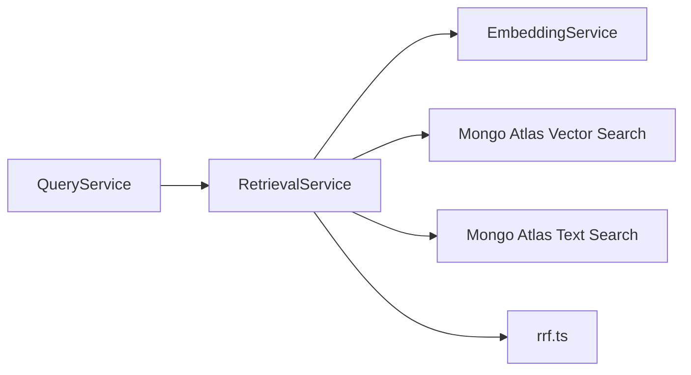

# Retrieval Service Implementation Guide

> Status: Implemented with known limitations
> Verified against: `src/services/retrieval.service.ts`
> Related services: QueryService, EmbeddingService, RerankerService

---

## Overview

`RetrievalService` handles candidate retrieval from `legalmind_rag.legal_chunks`. It implements hybrid search combining MongoDB Atlas Vector Search (`legal_chunks_vector`) and Atlas Text Search (`legal_chunks_text`), merged via Reciprocal Rank Fusion (RRF). It also executes exact legal reference lookup and parent/child chunk context window expansion.

---

## Inputs and Outputs

### Constructor Dependencies
- `embeddingService: EmbeddingService`

### Public Methods

#### `retrieveCandidateChunks(request: QueryRequest, parsedRef?: ParsedLegalReference): Promise<LegalChunks[]>`
* **Inputs**: `QueryRequest`, optional `ParsedLegalReference`.
* **Outputs**: Array of `LegalChunks` sorted by relevance.
* **Side Effects**: Generates dense embedding via `EmbeddingService`; queries MongoDB.

#### `findByArticle(parsedRef?: ParsedLegalReference): Promise<ChunkWithChildren | null>`
* **Inputs**: `ParsedLegalReference` (`articleNumber`, `lawName`, etc.).
* **Outputs**: Matching parent chunk document with child chunks attached, or `null`.

#### `findByAppeal(appealNumber: string, judicialYear?: string | null): Promise<ChunkWithChildren | null>`
* **Inputs**: Appeal number and optional judicial year.
* **Outputs**: Cassation ruling chunk document with child chunks attached, or `null`.

#### `vectorSearch(queryVector: number[], options?: SearchOptions): Promise<ChunkDocument[]>`
#### `textSearch(query: string, options?: SearchOptions): Promise<ChunkDocument[]>`
#### `expandWithParentContext(chunks: LegalChunks[]): Promise<LegalChunks[]>`

---

## Dependency Diagram

---

## Step-by-Step Runtime Flow

1. Parses legal references from request.
2. Generates query vector embedding (1024 dims) via `EmbeddingService.embedQuery()`.
3. In parallel, issues `$vectorSearch` and `$search` aggregation pipelines against `legal_chunks`.
4. Applies strict Egyptian governance filters: `jurisdiction: 'EG'`, `is_retrievable: true`, `reviewStatus: 'published'`, `authorityStatus IN ['effective', 'amended']`.
5. Merges vector and text results using Reciprocal Rank Fusion (`rrf.ts`, `K=60`).
6. Expands child chunks with parent context window if needed.
7. Returns candidate chunks for reranking.

---

## Function-by-Function Analysis

### `retrieveCandidateChunks(...)`
Main hybrid search method combining dense vector and sparse keyword search via RRF.

### `findByArticle(...)` / `findByAppeal(...)`
Deterministic exact lookups for specific articles or cassation court appeals.

### `vectorSearch(...)`
Executes `$vectorSearch` pipeline on `legal_chunks_vector` index.

### `textSearch(...)`
Executes `$search` pipeline on `legal_chunks_text` index using Lucene Arabic analyzer.

### `expandWithParentContext(...)`
Extracts a 4000-character context window around child chunks from parent document text.

---

## Configuration
Controlled by environment variables in `env`:
- `LEGALMIND_RETRIEVAL_TOP_K` (default: `20`)
- `LEGALMIND_RETRIEVAL_OVERFETCH` (default: `20`)
- `LEGALMIND_ENABLE_HYBRID_SEARCH` (default: `true`)
- `LEGALMIND_SPARSE_TOP_K` (default: `20`)
- `LEGALMIND_RRF_K` (default: `60`)

---

## Database Interaction
Read operations on `legalmind_rag.legal_chunks` via Mongoose `ChunkModel`.

---

## Security Implications
* Mandatory governance filters prevent draft or quarantined documents from leaking into RAG context.

---

## Known Limitations

### Current implementation
* Vector and text search queries require active MongoDB Atlas connection with pre-configured search indexes.

### Recommended future improvement
* Support local BM25 fallback for offline development.

---

## Tests
* Unit test: `src/query-tests/legal-query.unit.test.ts`

---

## Related Files and Call Sites

* Primary source: `src/services/retrieval.service.ts`
* Consumers: [QueryService](QUERY_SERVICE_IMPLEMENTATION.md)
* Dependencies: [EmbeddingService](EMBEDDING_SERVICE_IMPLEMENTATION.md), [RRF Utility](../utilities/RECIPROCAL_RANK_FUSION.md)
