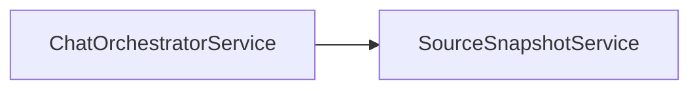

# Source Snapshot Service Implementation Guide

> Status: Implemented
> Verified against: `src/services/source-snapshot.service.ts`
> Related services: ChatOrchestratorService, ConversationService

---

## Overview

`SourceSnapshotService` converts retrieved domain `LegalChunks` into immutable `SourceSnapshot` objects attached to completed assistant messages. This freezes source titles, law numbers, article excerpts, and retrieval scores at query time.

---

## Inputs and Outputs

### Constructor Dependencies
None (`SourceSnapshotService` is stateless).

### Public Methods

#### `create(chunks: LegalChunks[]): SourceSnapshot[]`
* **Inputs**: Qualified `LegalChunks` array used during turn generation.
* **Outputs**: Array of frozen `SourceSnapshot` objects populated with `sourceId` (`S1`, `S2`), chunk IDs, titles, excerpts, scores, and timestamp `retrievedAt`.

---

## Dependency Diagram

---

## Step-by-Step Runtime Flow

1. Receives qualified evidence chunks from `QueryService`.
2. Assigns sequential source identifiers (`S1`, `S2`, ...).
3. Copies metadata (law number, law year, article number, court appeal, ruling date, corpus release ID).
4. Attaches timestamp `retrievedAt = new Date()`.
5. Returns snapshot array for persistence inside `MessageModel`.

---

## Function-by-Function Analysis

### `create(chunks: LegalChunks[]): SourceSnapshot[]`
Transforms live database chunks into historical snapshot records.

---

## Configuration
No environment variables required.

---

## Database Interaction
None (In-memory transformation).

---

## Security Implications
* Prevents historical chat logs from changing when underlying legal corpus chunks are updated or re-indexed.

---

## Known Limitations

### Current implementation
* Excerpt length reflects whatever text context window was provided by retrieval.

---

## Tests
* Integration test: `src/chat-tests/conversation.integration.test.ts`

---

## Related Files and Call Sites

* Primary source: `src/services/source-snapshot.service.ts`
* Callers: [ChatOrchestratorService](CHAT_ORCHESTRATOR_IMPLEMENTATION.md)
* Models: [MessageModel](../database/MESSAGE_MODEL.md)
